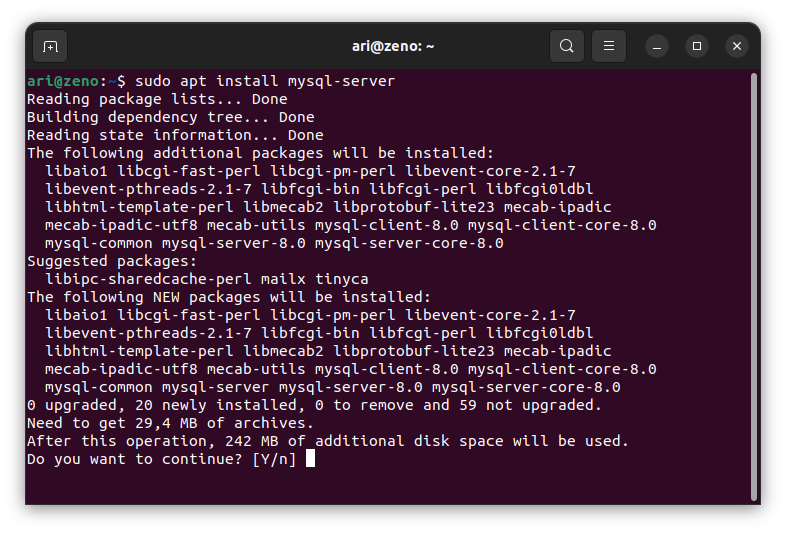
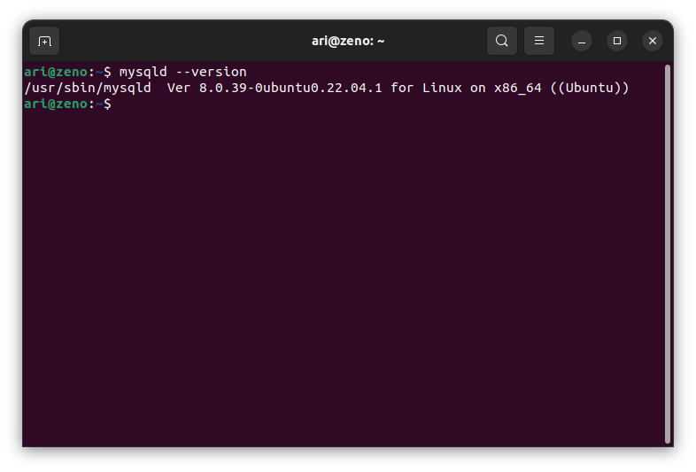
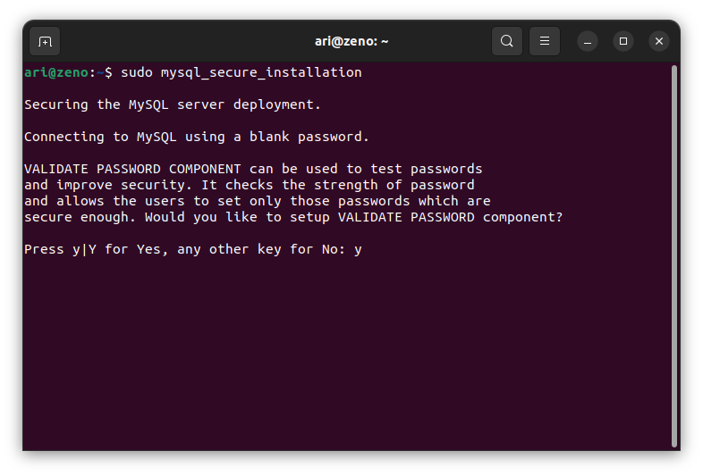
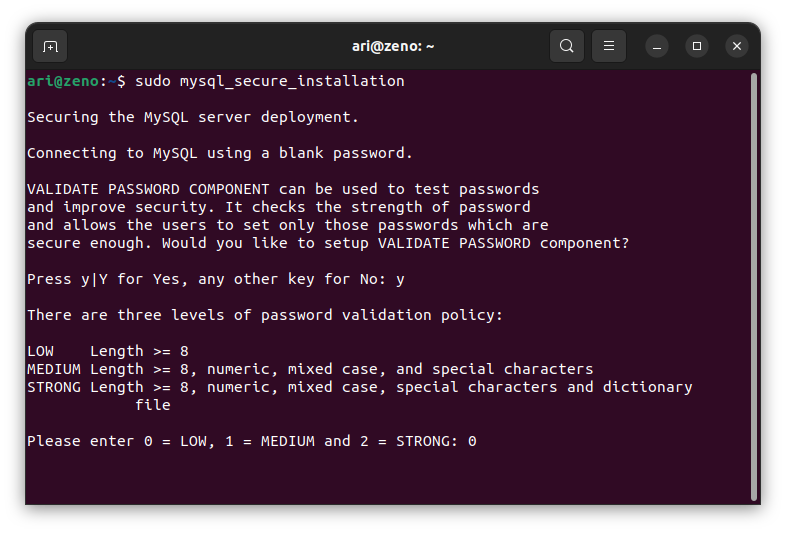
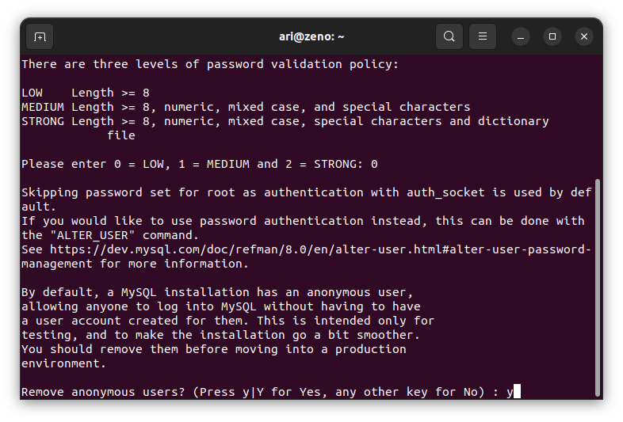
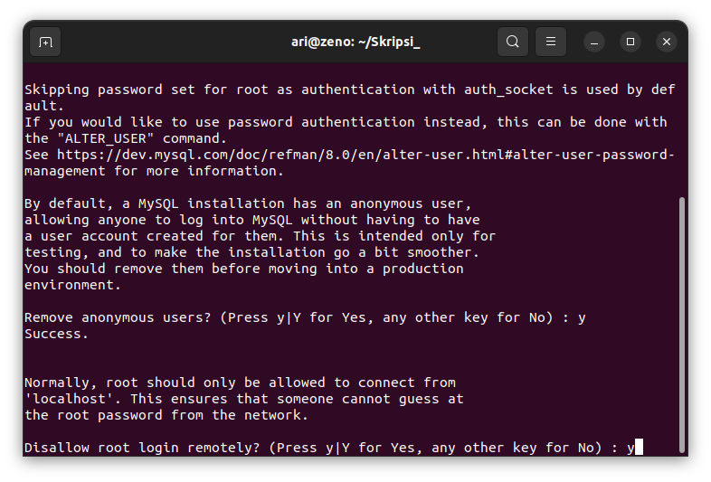
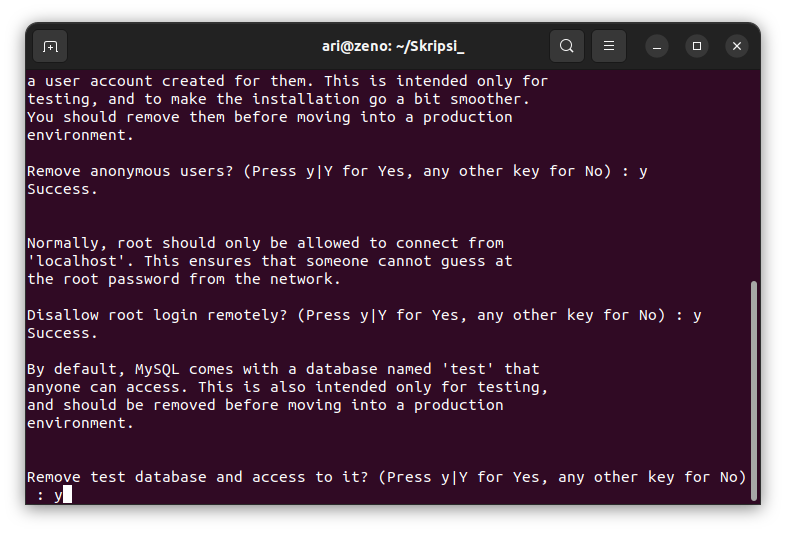
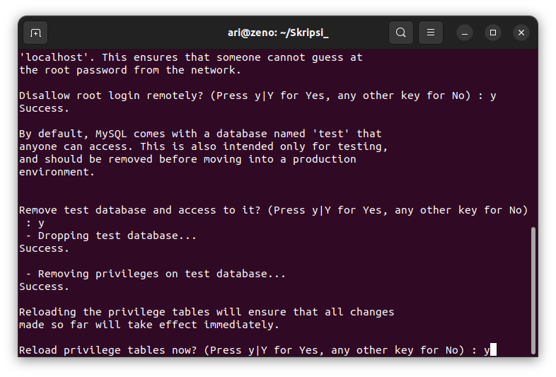
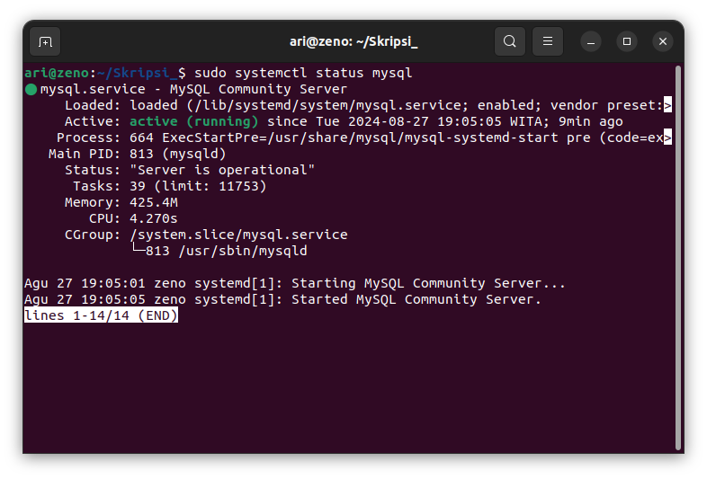
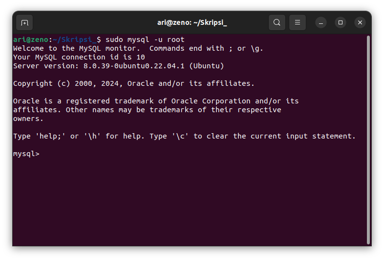

# Mata Kuliah Basis Data
Pada mata kuliah Basis Data perangkat lunak Virtual dibutuhkan selama pembelajaran adalah **DBMS** . Terdapat beragam DBMS yang populer dan digunakan secara luas di dunia teknologi antara lain MySQL, PostgreSQL, Oracle, Microsoft SQL Server, MongoDB dan Cassandra. Pada mata kuliah basis data DBMS yang digunakan adalah **MySQL**.

## Installasi MySQL
MySQL adalah relational database management system yang menggunakan SQL untuk menjalankan fungsinya. Fungsi utama SQL adalah untuk membuat query dan mengoperasikan sistem database. Untuk menginstall MySQL pada sistem operasi ubuntu ikuti langkah langkah berikut.

### 1. Update/Upgrade Package Repository

Untuk memastikan instalasi versi MySQL terbaru, perbarui repositori paket dengan perintah berikut:

   `sudo apt update`

   `sudo apt upgrade`

### 2. Install MySQL
Setelah repository di update, install MySQL dengan perintah `sudo apt install mysql-server`

Pastikan MySQL sudah terinstall dengan perintah `mysqld --version`

### 3. Securing MySQL
Setelah menginstal MySQL langkah selanjutnya adalah melakukan pengaturan keamanan awal untuk instalasi MySQL. Pengamanan mencakup pengaturan kata sandi yang kuat, menghapus akun dan database yang tidak diperlukan dan membatasi akses untuk meningkatkan keamanan secara keseluruhan.
Untuk mengamankan installasi jalankan perintah `sudo mysql_secure_installation`.

#### Validasi Password
Bagian pertama mengamankan instllasi adalah validasi password. Tekan y untuk mengkonfirmasi validasi password.

Pengguna memiliki tiga opsi untuk kebijakan kata sandi:
- 0 - low
- 1 - medium
- 2 - strong

Pilih salah satu kemudian tekan enter.

#### Remove Anonymous Users
Setelah instalasi, MySQL secara otomatis menggabungkan pengguna anonim, memungkinkan akses tidak terbatas tanpa akun pengguna khusus. Meskipun awalnya dirancang untuk pengujian dan instalasi yang disederhanakan, disarankan untuk menghapus pengguna ini demi alasan keamanan.

#### Disallow Root Login Remotely
Secara bawaan membatasi koneksi pengguna root ke mesin lokal (localhost) disarankan untuk mengurangi potensi risiko keamanan, seperti serangan brute force kredensial.

### Remove Test Database

### Reload Privilege Tables

### 4. Cek apakah MySQL Service telah berjalan
Setelah instalasi, layanan MySQL akan dimulai secara otomatis. Untuk memverifikasi bahwa server bekerja, jalankan perintah berikut `sudo systemctl status mysql`

### 5. Log in to MySQL Server
Untuk login ke MySQL server gunakan perintah `sudo mysql -u root`

[<<< Kembali](../../README.md)
