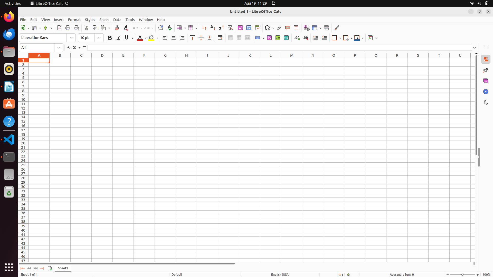
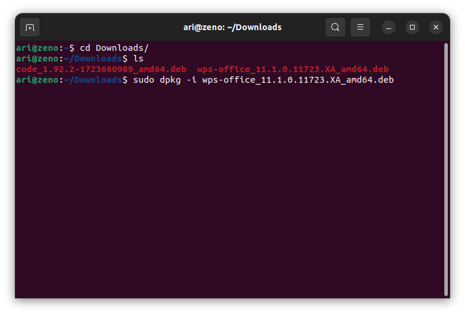
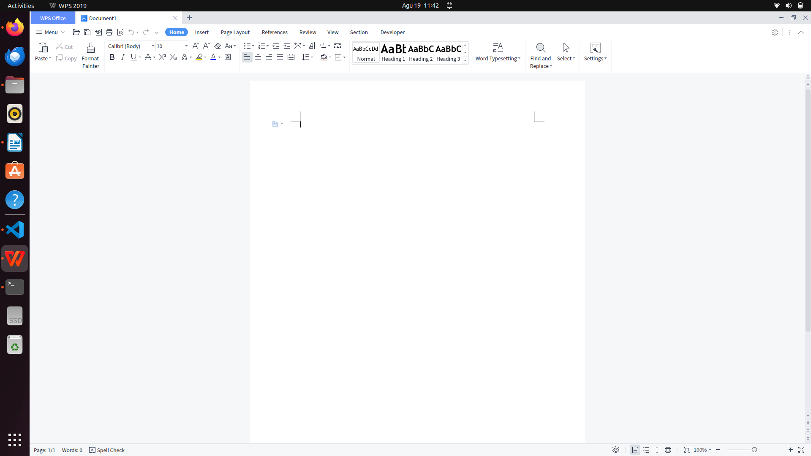
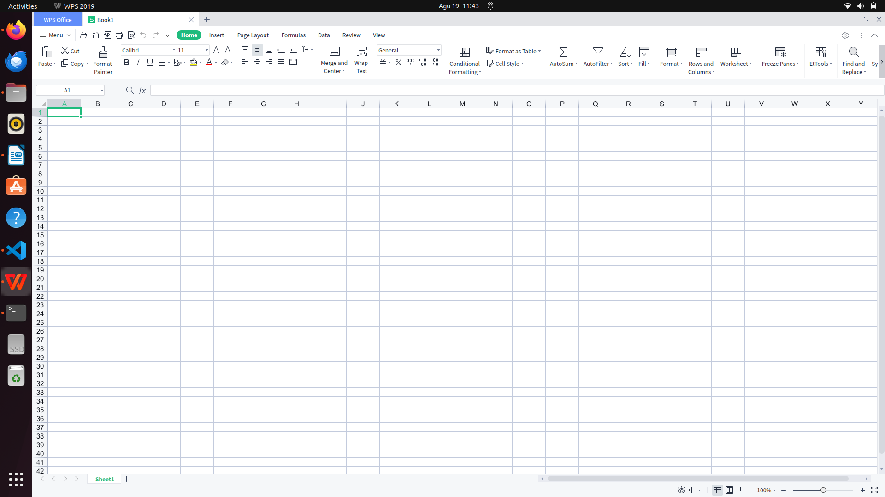
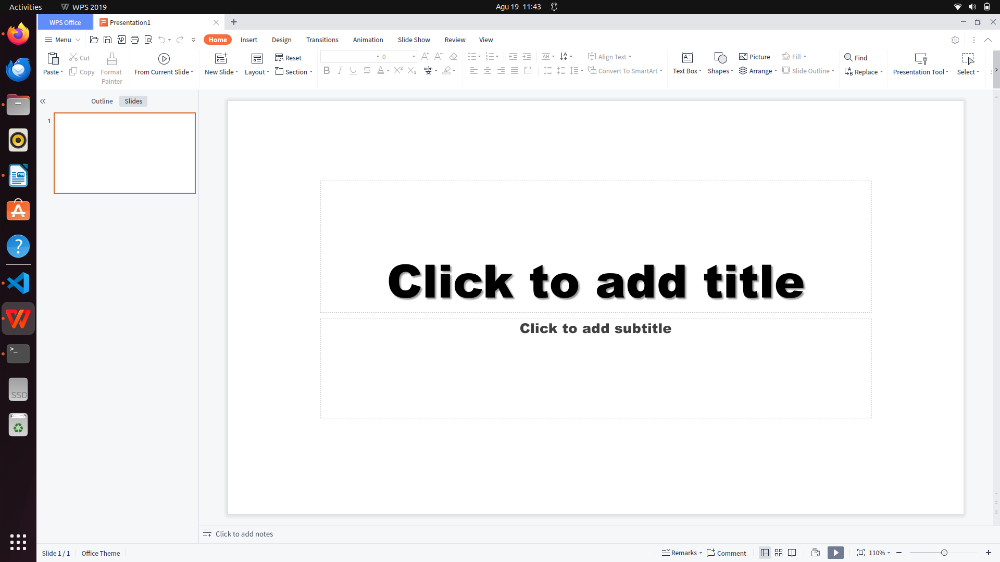

# Mata Kuliah Belajar Dan Pembelajaran
Pada mata kuliah Belajar Dan Pembelajaran perangkat lunak yang dibutuhkan selama pembelajaran adalah **office**. Secara bawaan ubuntu 22.04 sudah terinsall software libreOffice untuk keperluan pembuatan dokumen. Berikut adalah gambar dari software libreOffice :
- LibreOffice Writer (Software pembuat kata)

- LibreOffice Calc (Software pembuat angka)

- LibreOffice Impress (Software pembuat presentasi)

 
 - LibreOffice Math (Software untuk formula matematika)

 - LibreOffice Draw (Software untuk menggambar)

 
Alternatif lain untuk aplikasi office adalah wps office, kelebihan wps office adalah tampilannya yang mirip dengan office dari microsoft.

 ## Installasi WPS Office
 
  Terdapat 2 cara untuk menginstall WPS Office, yaitu dengan menggunakan GUI (Graphical User Interface) dan CLI (Command Line Interface).
 
  ## Installasi WPS Office dengan GUI
 Pada Ubuntu 22.04 terdapat aplikasi **ubuntu store** yang berfungsi untuk menginstall aplikasi berbasis GUI. Ubuntu store menggunakan repository snap dan apt sehingga cakupan software menjadi lebih luas.
 
 Untuk menginstall software pada **ubuntu store** klik icon pencarian pada pojok kiri atas pada **ubuntu store** kemudian masukkan keyword aplikasi yang ingin di install. Jika ditemukan software yang sesuai akan muncul berupa list nama dan icon software :
 
 
 
 Pilih software yang sesuai kemudian tekan tombol instal  :
 
 
 
  ## Installasi WPS Office dengan CLI
 
  Unduh paket installasi pada halaman [wps office](www.wps.com). Kemudian install paket tersebut dengan perintah `dpkg -i namafile.deb`, berikut gambar saat installasi  wps office :  
  
  
  Kemudian berikut adalah gambar dari software wps office :
  - WPS Writer (Software pembuat kata)
  
 
   - WPS Spreadsheet (Software pembuat angka)
  
 
    - WPS Spreadsheet (Software pembuat presentasi)
  

 
[<<< Kembali](../../README.md)
