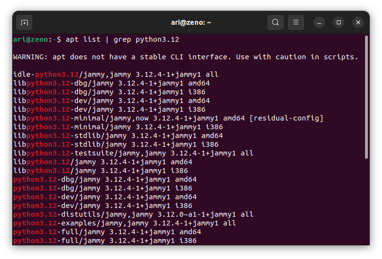
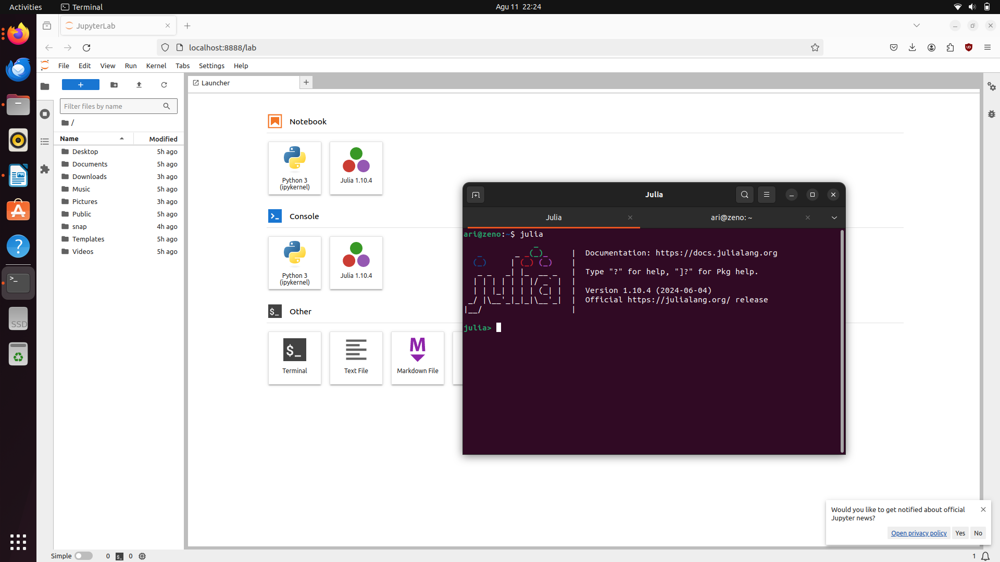
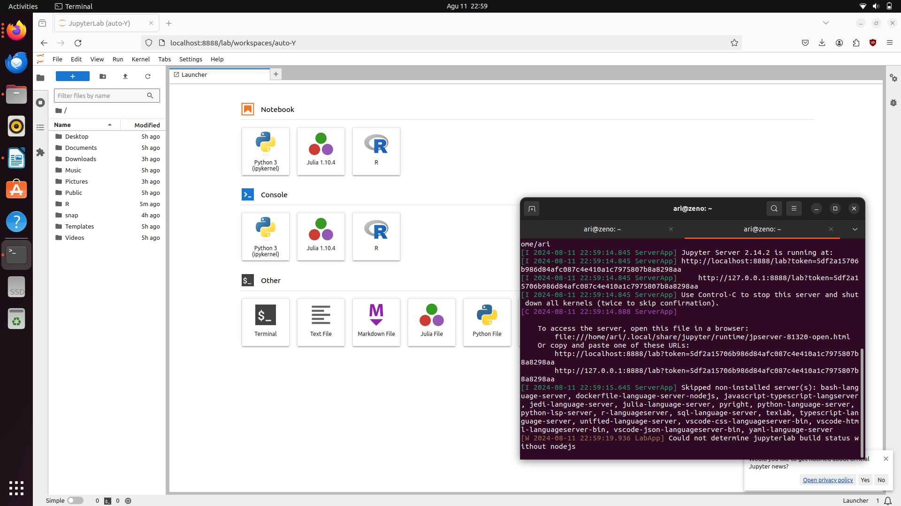
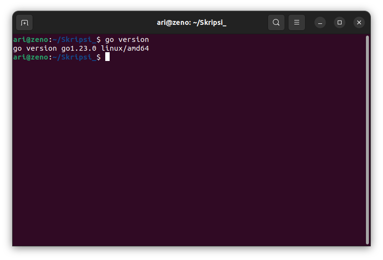
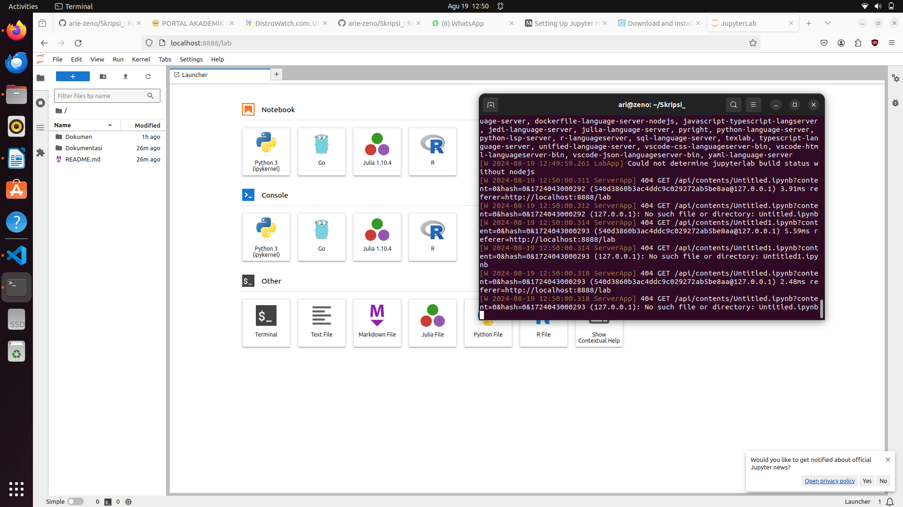

# Mata Kuliah Data Sains
Pada mata kuliah data sains perangkat lunak yang dibutuhkan adalah **python** dan **jupyter lab**.
## Installasi Python
Secara bawaan ubuntu **22.04** sudah tersinstall **python** versi 3.10.12, pada saat ini bulan Agustus 2024 versi terbaru python adalah 3.12.05. Untuk mengupgrade versi python yang terbaru berikut adalah langkah-langkah untuk mengupgrade versi python :
1. Tambahkan repository python dengan mengetikkan perintah `sudo add-apt-repository ppa:deadsnakes/ppa` pada terminal kemudian update repository dengan perintah `sudo apt update`.
2. Cek apakah pyhton 3.12 sudah ada pada list apt dengan perintah `apt list | grep python3.12`. Berikut adalah gambar 4.14 output dari perintah list apt untuk python3.12 .
   
3. Install python 3.12 dengan perintah `sudo apt install python3.12`. Berikut gambar 4.15 adalah python versi 3.12 yang sudah terinstall.
   

## Installasi Jupyter Lab
Pada halaman resmi jupyter.org installasi jupyter lab salah satunya dapat menggunakan tool installation python atau pip. Untuk menginstall pip ketikkan perintah `sudo apt install python3-pip`. Kemudian untuk installasi jupyter lab ketikkan perintah `pip install jupyterlab`. Jupyter lab akan terinstall di folder `/home/[user]/.local/bin`, agar bisa diakses secara publik modifikasi file .bashrc jika menggunakan terminal bash dan .zshrc jika menggunakan terminal zsh. Tambahkan kode `export PATH=’/[folder_jupyter_lab]/bin:$PATH` pada baris terakhir. Berikut adalah gambar 4.16 penambahan environment pada terminal bash.

Untuk menjalankan jupyter lab ketikkan perintah `jupyter lab` pada terminal. Selanjutnya juga dibutuhkan kernel julia dan R pada jupyter lab untuk keperluan pengolahan data lainnya.

### Menambahkan Kernel Julia
Untuk menginstall julia ketikkan perintah `curl -fsSL https://install.julialang.org | sh`. Setelah installasi selesai masuk ke sesi julia RPEL dengan perintah `julia` pada terminal. Pada julia RPEL ketikkan perintah `using Pkg` kemudian `Pkg.add(“Ijulia”)` untuk menambahkan kernel julia ke dalam jupyter lab. Berikut adalah gambar 4.17 setelah menambahkan kernel julia pada jupyter lab.

### Menambahkan Kernel R
Untuk menambahkan R kedalam jupyter lab pastikan sudah menginstall R terlebih dahulu, jika belum install R dengan perintah `sudo apt install r-base-core`. Setelah terinstall masuk ke session R dengan perintah `R` kemudian install paket yang diperlukan dengan perintah `install.packages(c('repr', 'IRdisplay', 'IRkernel'), type = 'source')` dan `Irkernel::installspec()`. Berikut adalah gambar 4.18 tampilan jupyter lab setelah menambahkan kernel R.

### Menambahkan Kernel Golang
Untuk menambahkan Golang kedalam jupyter lab pastikan sudah menginstall Golang terlebih dahulu, jika belum install Golang download file installer go pada link [download golang](https://go.dev/doc/install). Kemudian ekstrak file tersebut dengan perintah `tar -C /usr/local -xzf go1.23.0.linux-amd64.tar.gz`, tambahkan PATH go dengan memodifikasi file .bashrc jika menggunakan terminal bash dan .zshrc jika menggunakan terminal zsh dengan menambahkan kode `export PATH=$PATH:/usr/local/go/bin` pada baris terakhir. Berikut adalah gambar setelah menginstall golang pada ubuntu :

Kemudian install Gophernotes, Gophernotes merupakan kernel golang untuk jupyter. Install dengan menggunakan perintah `go get github.com/gopherdata/gophernotes`. Kemudian konfigurasi dengan perintah :

`mkdir -p ~/.local/share/jupyter/kernels/gophernotes`

`cp $(go env GOPATH)/pkg/mod/github.com/gopherdata/gophernotes@v0.7.5/kernel/* ~/.local/share/jupyter/kernels/gophernotes`

`cd ~/.local/share/jupyter/kernels/gophernotes`

`chmod +w ./kernel.json # in case copied kernel.json has no write permission`

`$ sed "s|gophernotes|$(go env GOPATH)/bin/gophernotes|" < kernel.json.in > kernel.json`

Berikut adalah gambar setelah menambahkan kernel golang pada jupyter : 

[<<< Kembali](../../README.md)