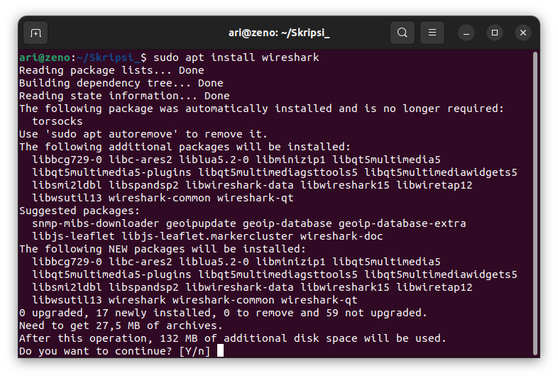
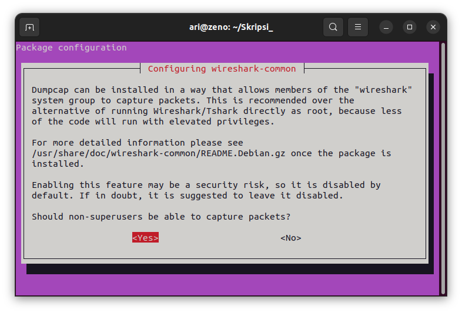
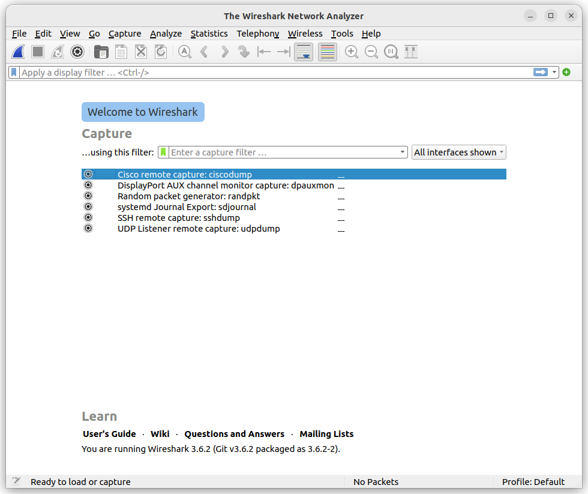

# Mata Kuliah Jaringan dan Komunikasi Data
Pada mata kuliah Jaringan dan Komunikasi Data perangkat lunak yang dibutuhkan selama pembelajaran adalah **Wireshark** .

## Wireshark
Wireshark sudah tersedia pada paket apt, untuk  menginstall Wireshark gunakan perintah `sudo apt install wireshark` pada terminal. Berikut gambar saat installasi Wireshark.
 

Pilih yes pada jendela yang muncul agar user yang bukan superuser dapat merekam paket.

 

Kemudian berikut adalah gambar Wireshark pada sistem operasi Ubuntu.

 

[<<< Kembali](../../README.md)
