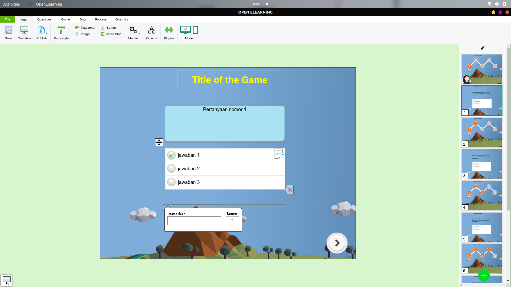

# Mata Kuliah Media_dan_Teknologi_Pembelajaran
Pada mata kuliah Media dan Teknologi Pembelajaran perangkat lunak yang dibutuhkan selama pembelajaran adalah **iSpring**, namun ***iSpring*** tidak tersedia untuk linux sehingga pada mata kuliah ini memerlukan alternatif software iSpring yaitu ***Open Elearning***.

 ## Instalasi Open Elearning
 Unduh paket instalasi pada halaman [Open Elearning](https://www.openelearning.org/download). Kemudian install paket tersebut dengan perintah `dpkg -i namafile.deb`, berikut gambar saat installasi  Open Elearning :  
 
 
 Kemudian berikut adalah gambar dari software Open Elearning setelah terinstal yang digunakan untuk membuat slide presentasi interaktif :

 

[<<< Kembali](../../README.md)
