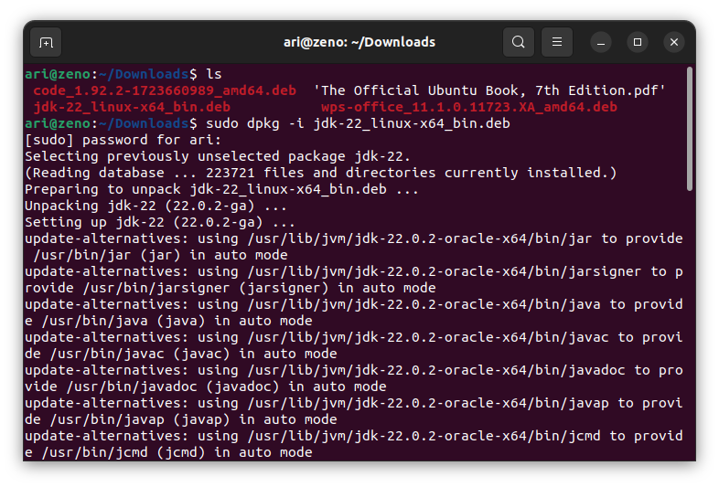
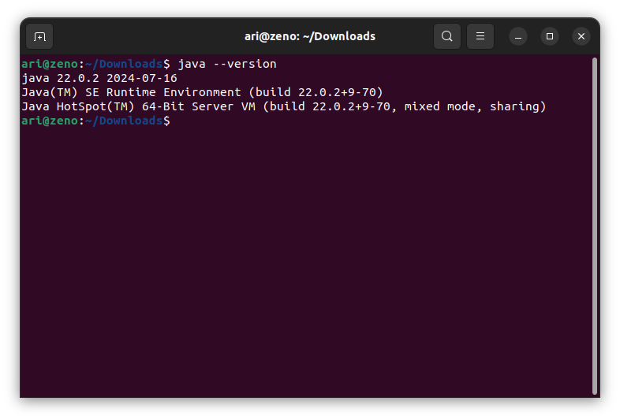
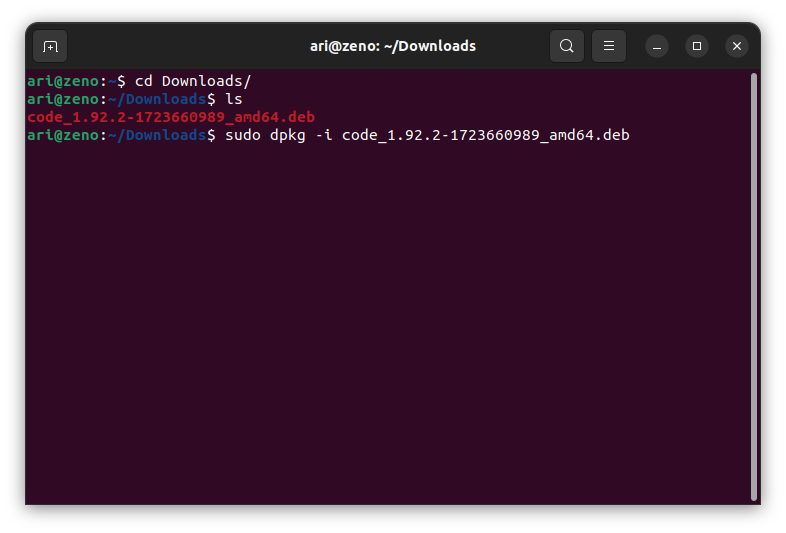

# Mata Kuliah Pemrograman Dasar 2
Pada mata kuliah Pemrograman Dasar 2 perangkat lunak yang dibutuhkan selama pembelajaran adalah **Code Editor / IDE dan Java** .

## Installasi Java
Untuk menjalankan program java diperlukan JDK (Java Development Kit), unduh paket installasi java pada halaman [Download Java](https://www.oracle.com/id/java/technologies/downloads/). Kemudian install paket tersebut dengan perintah `dpkg -i namafile.deb`, berikut gambar saat installasi Java :  
 

Untuk memeriksa apakah java sudah terinstall ketikkan perintah `java --version` pada terminal
 

 ## Installasi Visual Studio Code
 Unduh paket installasi pada halaman [Visual Studio Code](www.code.visualstudio.com). Kemudian install paket tersebut dengan perintah `dpkg -i namafile.deb`, berikut gambar saat installasi  Visual Studio Code :  
 
 
 Kemudian berikut adalah gambar dari software visual studio code setelah terinstall :

[<<< Kembali](../../README.md)
