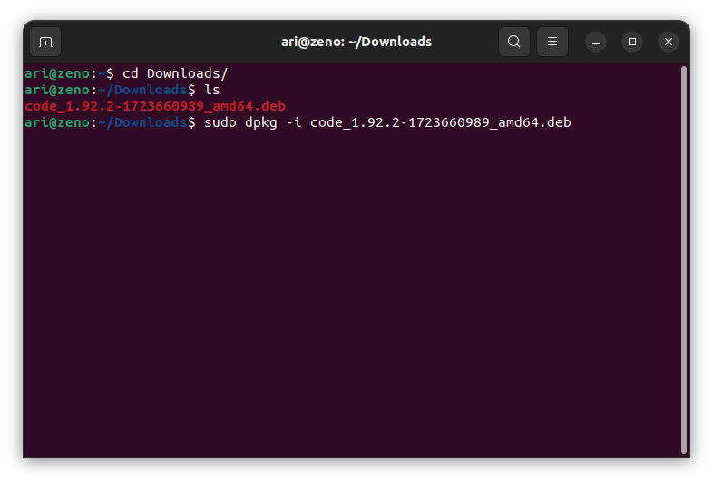
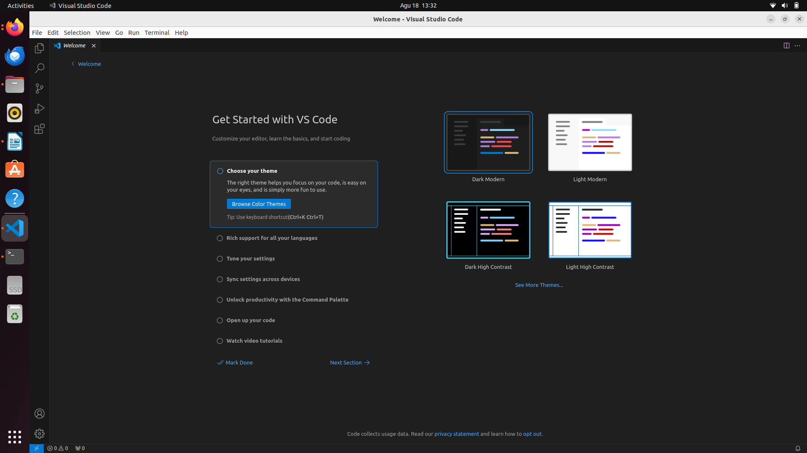

# Mata Kuliah Pemrograman Web 1
Pada mata kuliah Pemrograman Web 1 perangkat lunak yang dibutuhkan selama pembelajaran adalah **Code Editor / IDE** yang digunakan untuk membuat kode html, css dan Javascript. Ada banyak jenis Code Editor / IDE yang populer saat ini, salah satunya adalah **visual studio code**. 

 ## Installasi Visual Studio Code
 Terdapat 2 cara untuk menginstall Jupyter Lab yaitu dengan menggunakan GUI (Graphical User Interface) dan CLI (Command Line Interface).

 ## Installasi Visual Studio Menggunakan GUI

Pada Ubuntu 22.04 terdapat aplikasi **ubuntu software** yang berfungsi untuk menginstall aplikasi berbasis GUI. Ubuntu software menggunakan repository snap dan apt sehingga cakupan software menjadi lebih luas.

Untuk menginstall software pada **ubuntu software** klik icon pencarian pada pojok kiri atas pada **ubuntu software** kemudian masukkan keyword aplikasi yang ingin di install. Jika ditemukan software yang sesuai akan muncul berupa list nama dan icon software :

Pilih software yang sesuai kemudian tekan tombol instal  :

 ## Installasi Visual Studio Code Menggunakan CLI
 Unduh paket installasi pada halaman [Visual Studio Code](www.code.visualstudio.com). Kemudian install paket tersebut dengan perintah `dpkg -i namafile.deb`, berikut gambar saat installasi  Visual Studio Code :  
 
 
 Kemudian berikut adalah gambar dari software visual studio code setelah terinstall :

[<<< Kembali](../../README.md)
