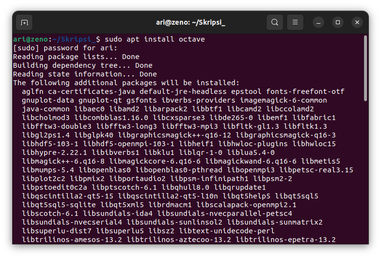
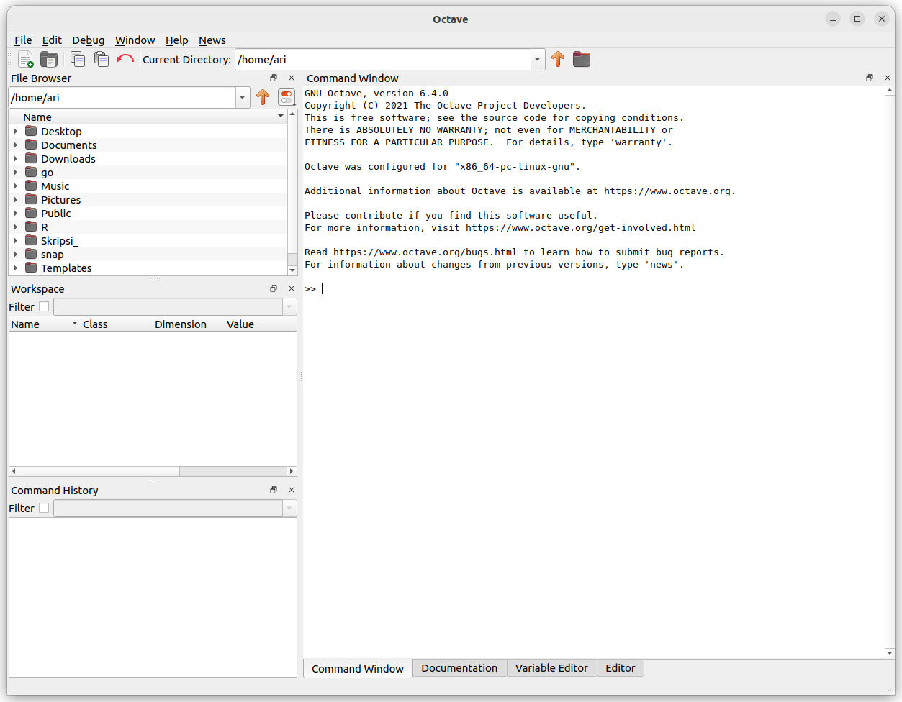

# Mata Kuliah Pemrosesan Citra Digital
Pada mata kuliah Pemrosesan Citra Digital perangkat lunak yang dibutuhkan selama pembelajaran adalah **GNU Octave** .

## GNU Octave
GNU octave sudah tersedia pada paket apt, untuk  menginstall GNU Octave gunakan perintah `sudo apt install octave`. Berikut gambar saat installasi GNU Octave.
 

Kemudian berikut adalah gambar GNU Octave pada sistem operasi Ubuntu.

 

[<<< Kembali](../../README.md)
