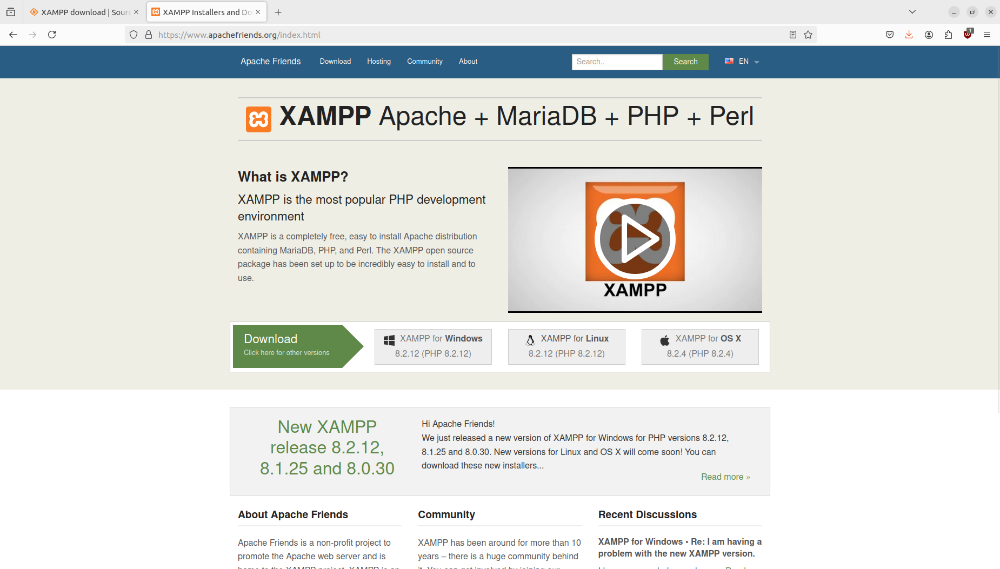
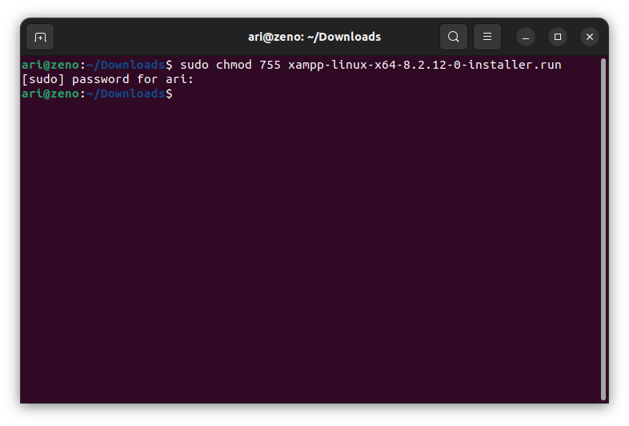
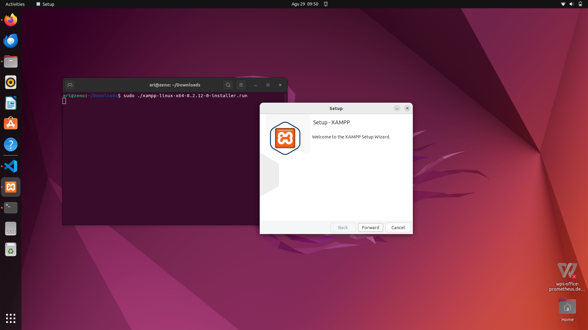
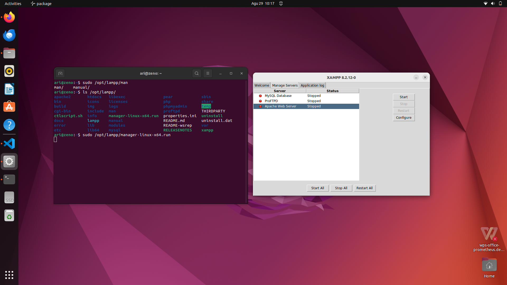

# Mata Kuliah Pengembangan Open Source
Pada mata kuliah Pengembangan Open Source perangkat lunak yang dibutuhkan selama pembelajaran adalah **Code Editor / IDE dan XAMPP** .

 ## Installasi Visual Studio Code
 Unduh paket installasi pada halaman [Visual Studio Code](www.code.visualstudio.com). Kemudian install paket tersebut dengan perintah `dpkg -i namafile.deb`, berikut gambar saat installasi  Visual Studio Code :  
 
 
 Kemudian berikut adalah gambar dari software visual studio code setelah terinstall :

## Installasi XAMPP

Kunjungi halaman [XAMPP](https://www.apachefriends.org) untuk mengunduh paket installasi xampp.

Ubah permissions file agar bisa dieksekusi dengan perintah `chmod 755 xampp-linux-*-installer.run`

Kemudian eksekusi installer dengan perintah `sudo ./xampp-linux-*-installer.run` maka jendela setup installasi akan muncul.

Setelah selesai setup, xampp akan terinstall pada folder /opt/lampp

Untuk menjalankan service xampp melalui CLI dapat menggunakan perintah `sudo /opt/lampp/lampp start`. Untuk memeriksa service apakah sudah berjalan gunakan perintah ` sudo /opt/lampp/lampp status`. Kemudian untuk menghentikan service xampp dapat menggunakan perintah `sudo /opt/lampp/lampp stop`.

Untuk menjalankan service xampp dengan GUI jalankan perintah `sudo /opt/lampp/manager-linux-x64.run`

[<<< Kembali](../../README.md)
