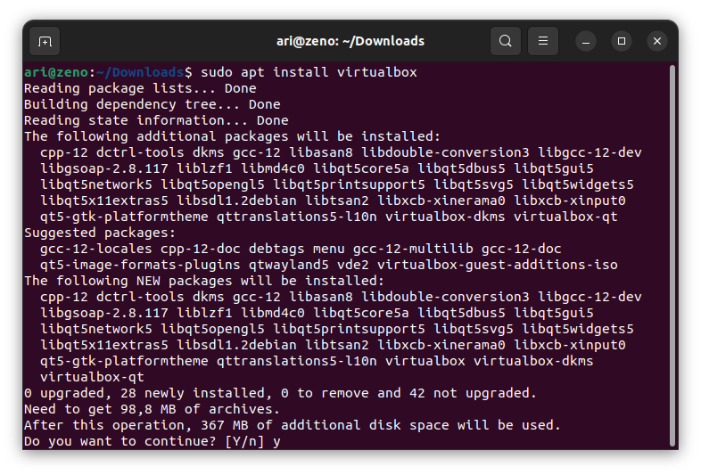
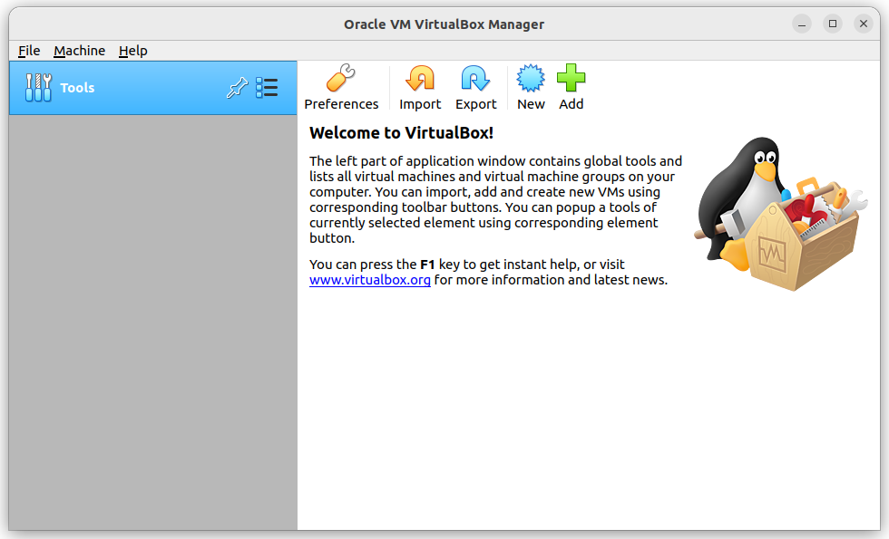
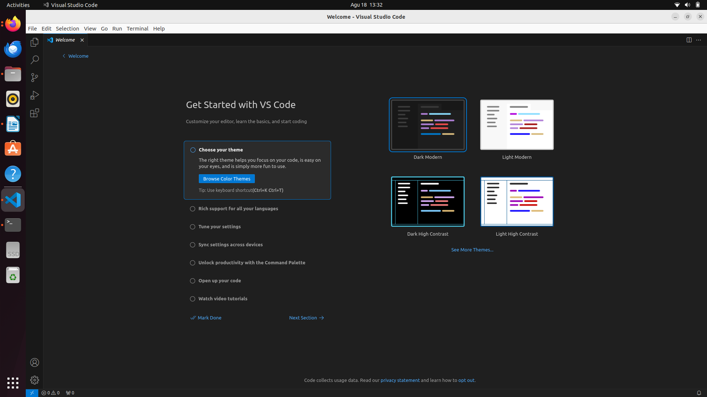

# Mata Kuliah Sistem Operasi
Pada mata kuliah Sistem Operasi perangkat lunak Virtual dibutuhkan selama pembelajaran adalah **Code Editor / IDE dan Virtual** . Ada beberapa pilihan virtual machine seperti **Virtual Box** dan **VMWare**, namun disini saya menggunakan virtual box sebagai virtual machine yang saya gunakan.

## Installasi Virtual Box
VirtualBox adalah perangkat lunak virtualisasi yang dapat digunakan untuk mengeksekusi sistem operasi "tambahan" di dalam sistem operasi "utama". Untuk menginstall virtualbox pada ubuntu ketikkan perintah `sudo apt install virtualbox` pada terminal.

berikut virtual box yang baru saja diinstall.

 ## Installasi Visual Studio Code
 Unduh paket installasi pada halaman [download virtualbox](https://www.virtualbox.org/wiki/Linux_Downloads). Kemudian install paket tersebut dengan perintah `dpkg -i namafile.deb`, berikut gambar saat installasi  Visual Studio Code :  
 
 
 Kemudian berikut adalah gambar dari software visual studio code setelah terinstall :

[<<< Kembali](../../README.md)
