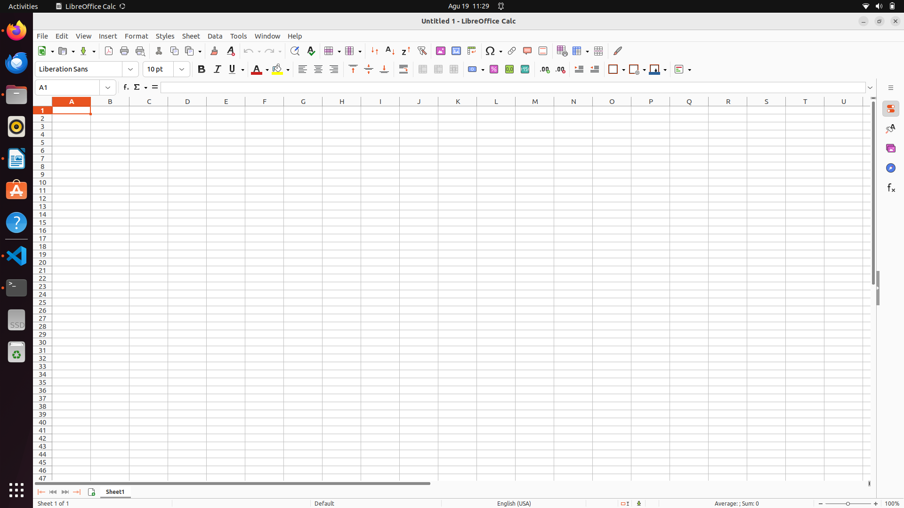
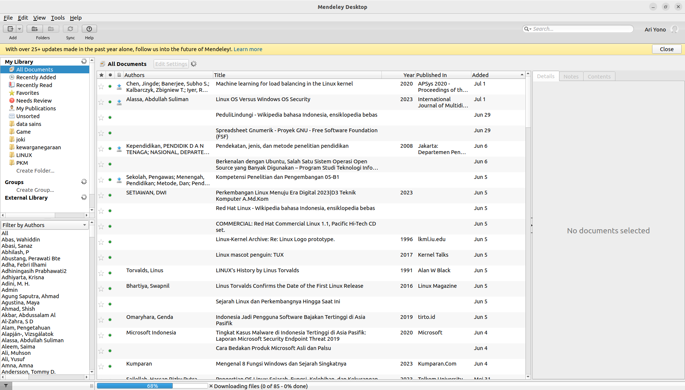

# Mata Kuliah Skripsi
Pada mata kuliah Skripsi perangkat lunak yang dibutuhkan selama pembelajaran adalah **Office dan Mendeley** .

## Installasi Office
Secara bawaan ubuntu 22.04 sudah terinsall software libreOffice untuk keperluan pembuatan dokumen. Berikut adalah gambar dari software libreOffice :
- LibreOffice Writer (Software pembuat kata)

- LibreOffice Calc (Software pembuat angka)

- LibreOffice Impress (Software pembuat presentasi)

 
 - LibreOffice Math (Software untuk formula matematika)

 - LibreOffice Draw (Software untuk menggambar)

## Installasi Mendeley
Untuk software mendeley versi desktop dapat di install melalui paket flapak, namun secara bawaan flatpak belum terinstall pada sistem operasi ubuntu.

### Installasi Flatpak
Untuk menginstall flatpak ketikkan perintah `sudo apt install flatpak` kemudian tambahkan repository flathub dengan perintah `flatpak remote-add --if-not-exists flathub https://dl.flathub.org/repo/flathub.flatpakrepo`.

Setelah menginstall flatpak kunjungi https://flathub.org kemudian cari 'mendeley' untuk melihat perintah installasinya.

install mendeley dengan perintah `flatpak install flathub com.elsevier.MendeleyDesktop`. 

Pada saat pertama kali membuka software mendeley akan diminta login terlebih dahulu.

Berikut adalah gambar mendeley pada sistem operasi ubuntu.

## Mengintegrasikan LibreOffice Writer dengan mendeley
Untuk mengintegrasikan LibreOffice Writer dengan mendeley buka terlebih dahulu libreOffice Writer kemudian pada tab tools pilih extension manager atau tekan shortcut `CTRL + ALT E`.

tambahkan extension mendeley dengan mengklik tombol `add` kemudian pilih mendeley extension yang berada pada `/var/lib/flatpak/app/com.elsevier.MendeleyDesktop/current/active/files/extra/share/mendeleydesktop/openOfficePlugin/Mendeley-x.xx.x.oxt`.

Setelah itu buka kembali libreOffice Writer dan mendeley sudah terintegrasi dengan libreOffice Writer.

[<<< Kembali](../../README.md)
