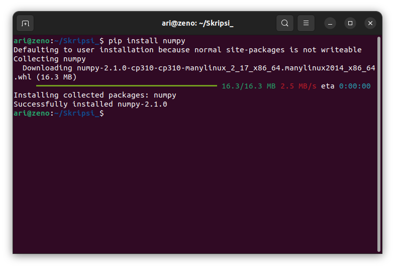

# Mata Kuliah Struktur Data
Pada mata kuliah Struktur Data perangkat lunak yang dibutuhkan selama pembelajaran adalah **Code Editor / IDE, Python dan Pip** .

 ## Installasi Visual Studio Code
 Unduh paket installasi pada halaman [Visual Studio Code](www.code.visualstudio.com). Kemudian install paket tersebut dengan perintah `dpkg -i namafile.deb`, berikut gambar saat installasi  Visual Studio Code :  
 
 
 Kemudian berikut adalah gambar dari software visual studio code setelah terinstall :

## Installasi Python & Pip
Secara bawaan ubuntu **22.04** sudah tersinstall **python** versi 3.10.12, namun paket pip belum terinstall pada ubuntu 22.04. Untuk menginstall pip gunakan perintah `sudo apt install python3-pip`. Pada mata kuliah struktur data diperlukan beberapa library seperti numpy, untuk menginstall numpy dapat menggunakan perintah `pip install numpy` pada terminal. Berikut adalah gambar installasi library numpy :

[<<< Kembali](../../README.md)
