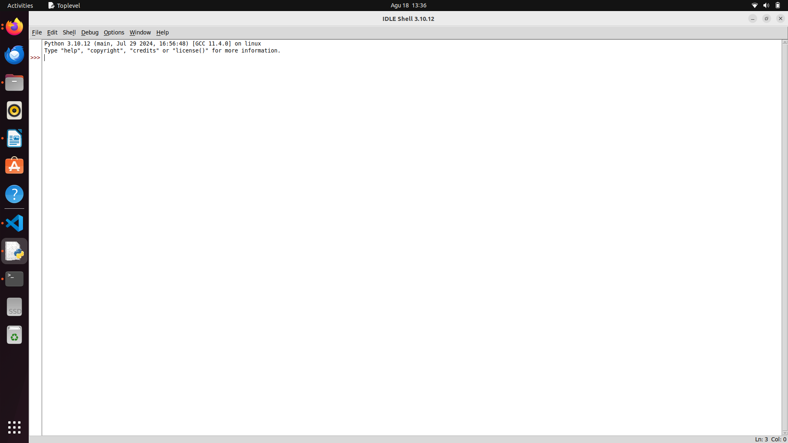
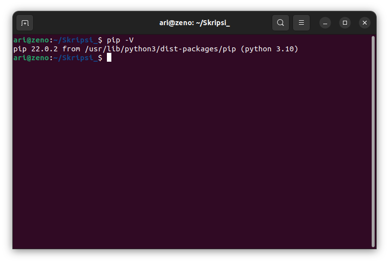

# Mata Kuliah Kriptografi dan Keamanan Informasi
Pada mata kuliah Kriptografi dan Keamanan Informasi perangkat lunak yang dibutuhkan selama pembelajaran adalah **python**.
 
 ## Installasi Python
 Secara bawaan ubuntu **22.04** sudah tersinstall **python** versi 3.10.12, namun paket seperti pip dan idle-python belum terinstall.

 ## Installasi idle-pthon dan pip
 **Idle** dan **pip** python sudah tersedia pada paket APT sehingga untuk menginstall idle-python dapat langsung menggunakan perintah `sudo apt install idle-python3.10` dan `sudo apt install python3-pip` pada terminal. Berikut tampilan idle-python pada sistem operasi ubuntu :

 

 berikut gambar pip yang sudah terinstall :

 
 

[<<< Kembali](../../README.md)
