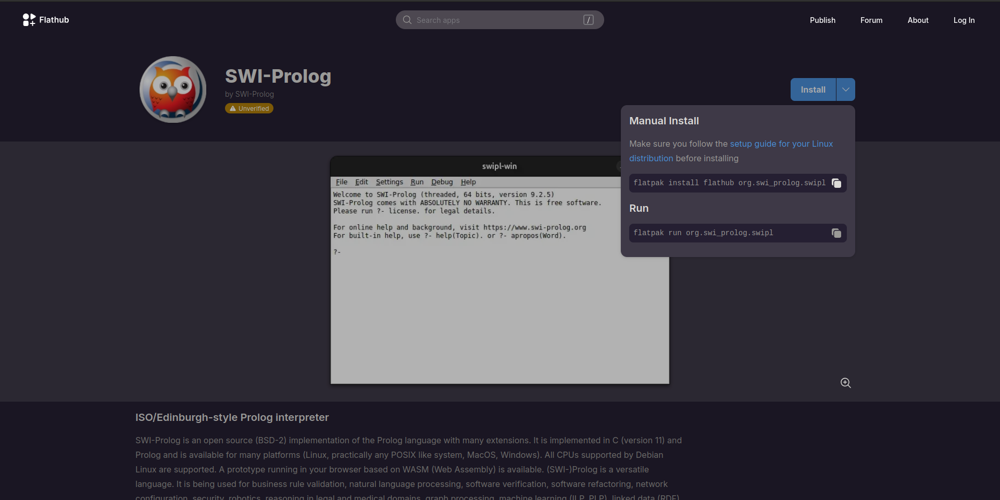
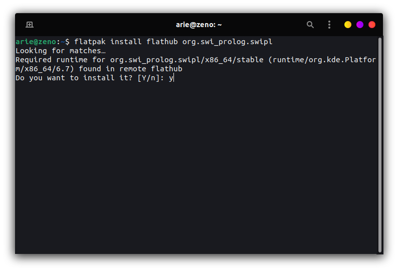
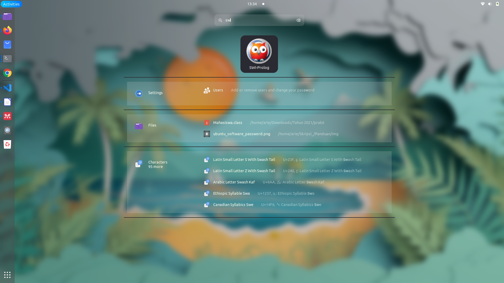
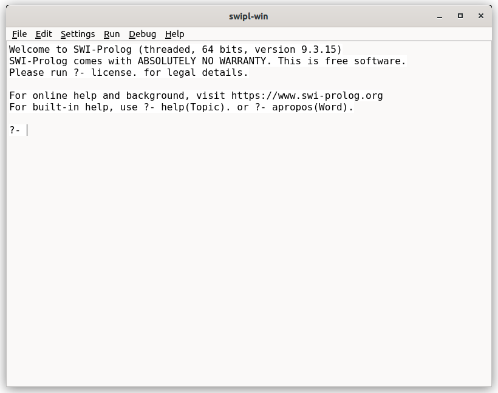

# Mata Kuliah Pemrograman Logika
Pada mata kuliah Pengembangan Pemrograman Logika perangkat lunak yang dibutuhkan selama pembelajaran adalah **SWI-Prolog** .

 ## Installasi SWI-Prolog
 Kunjungi halaman [flathub.org](http://flathub.org) kemudian pada kolom pencarian masukkan keyword **"SWI-Prolog"**.

 
 
 Kemudian masukkan script yang tertera untuk melakukan instalasi SWI-Prolog pada terminal :

Tunggu hingga proses selesai, setelah selesai SWI-Prolog dapat ditemukan pada menu ***Applications***.

Berikut adalah SWI-Prolog yang sedang berjalan pada sistem operasi Ubuntu :

[<<< Kembali](../../README.md)
