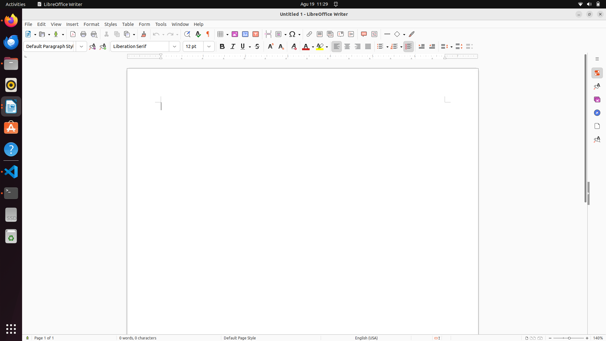
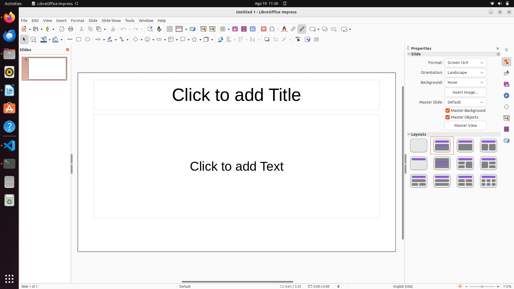
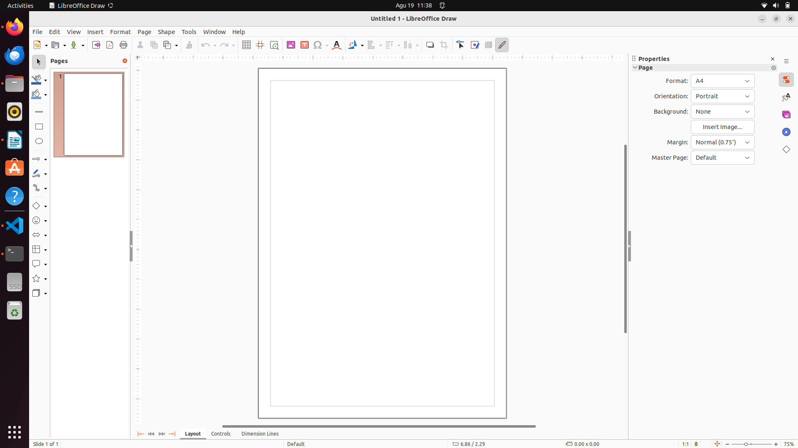
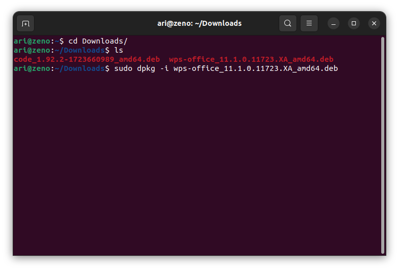
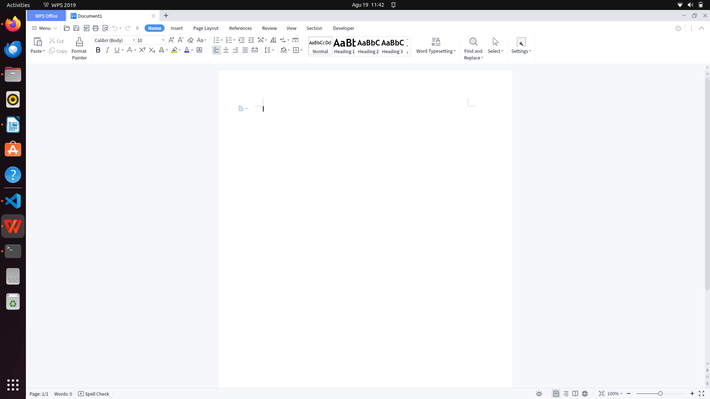
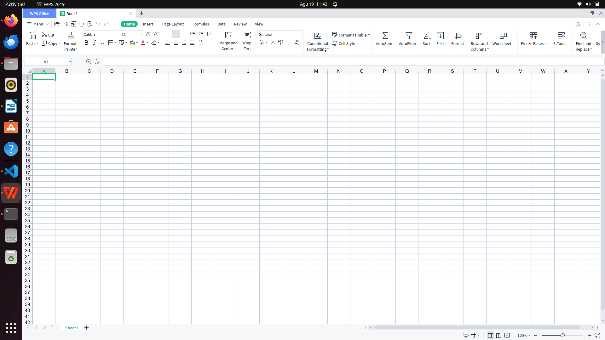

# Mata Kuliah Komputer Masyarakat
Pada mata kuliah Komputer Masyarakat perangkat lunak yang dibutuhkan selama pembelajaran adalah **office**. Secara bawaan ubuntu 22.04 sudah terinsall software libreOffice untuk keperluan pembuatan dokumen. Berikut adalah gambar dari software libreOffice :
- LibreOffice Writer (Software pembuat kata)

- LibreOffice Calc (Software pembuat angka)

- LibreOffice Impress (Software pembuat presentasi)

 
 - LibreOffice Math (Software untuk formula matematika)

 - LibreOffice Draw (Software untuk menggambar)

 
Alternatif lain untuk aplikasi office adalah wps office, kelebihan wps office adalah tampilannya yang mirip dengan office dari microsoft.

 ## Installasi WPS Office
 Unduh paket installasi pada halaman [wps office](www.wps.com). Kemudian install paket tersebut dengan perintah `dpkg -i namafile.deb`, berikut gambar saat installasi  wps office :  
 
 
 Kemudian berikut adalah gambar dari software wps office :
 - WPS Writer (Software pembuat kata)
 

  - WPS Spreadsheet (Software pembuat angka)
 

   - WPS Spreadsheet (Software pembuat presentasi)
 

 
[<<< Kembali](../../README.md)
