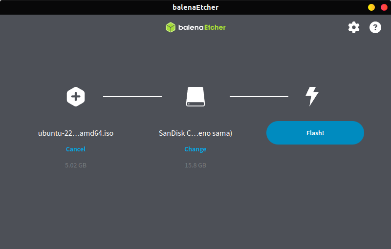

# Pembuatan Bootable USB
## Tujuan
Setelah menyelesaikan bab ini pembaca diharapkan dapat:
- Memahami langkah-langkah membuat media instalasi Ubuntu (Bootable USB).
- Membuat media instalasi Ubuntu (Bootable USB).

## Alat yang diperlukan
- Perangkat Lunak 
  - Etcher (tersedia untuk Windows, MacOS dan Linux), dapat didownload pada link berikut [etcher.balena.io](https://etcher.balena.io/)
- Perangkat Keras
  - USB Flashdrive minimal 8 GB.

## Langkah-Langkah Membuat Bootable USB
1. Sambungkan USB flash drive minimal 8 GB ke komputer.
2. Buka aplikasi Etcher yang sudah diunduh dan diinstal.
3. Pada tampilan utama Etcher, klik Select Image dan pilih file ISO Ubuntu yang telah diunduh.
4. Klik Select Target dan pilih USB yang akan digunakan sebagai media instalasi.
5. Klik Flash! untuk memulai proses pembuatan bootable USB.
     
 

     

     

  
6. Tunggu hingga proses selesai, dan lepaskan USB setelah flash selesai.

[Kembali](./instalasi_ubuntu.md) 

