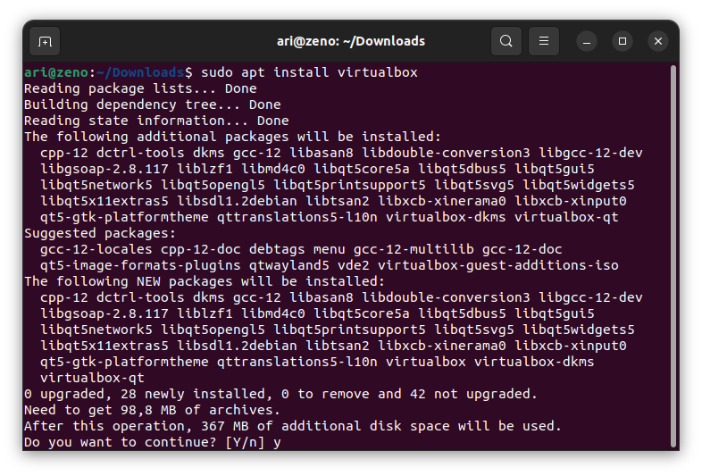

# Instalasi Aplikasi di Ubuntu  Menggunakan CLI dengan APT
## Tujuan
Setelah menyelesaikan bab ini pembaca diharapkan dapat:
- Menginstal perangkat lunak menggunakan CLI pada Ubuntu menggunakan APT.

## Langkah-Langkah Instalasi Melalui CLI dengan APT
1. **Buka Terminal** 
   Untuk mengakses CLI, buka terminal dengan menekan kombinasi tombol `Ctrl + Alt + T` atau cari "Terminal" di menu ***Applications***. Terminal akan terbuka dan siap menerima perintah.
2. **Perbaruan daftar paket** 
   Sebelum melakukan instalasi aplikasi penting untuk memperbarui daftar paket agar sistem memiliki informasi terbaru tentang perangkat lunak di repositori. Jalankan perintah `sudo apt update` kemudian masukkan password ketika diminta, kemudian sistem akan mengunduh daftar paket terbaru.
3. **Install Aplikasi** 
   Setelah daftar paket diperbarui anda dapat melakukan instalasi aplikasi dengan perintah `apt install`. Sebagai contoh untuk instalasi VirtualBox jalankan perintah `sudo apt install virtualbox`, sistem akan mengunduh dan melakukan instalasi aplikasi beserta dependensinya.

   
 

   

   

4. **Konfirmasi Instalasi** 
   Jika ada konfirmasi untuk melanjutkan instalasi, sistem akan menampilkan prompt yang meminta anda mengetik "**y**" (yes) untuk melanjutkan. Tekan y dan ***Enter*** untuk konfirmasi.
5. **Instalasi Selesai** 
   Setelah proses selesai, aplikasi siap digunakan. Aplikasi yang telah diinstal dapat ditemukan di menu Applications, atau bisa langsung dibuka melalui terminal dengan mengetik nama aplikasinya.

 
 

  <a href="https://example.com">Sebelumnya</a>
  <a href="https://example.com">Selanjutnya</a>

