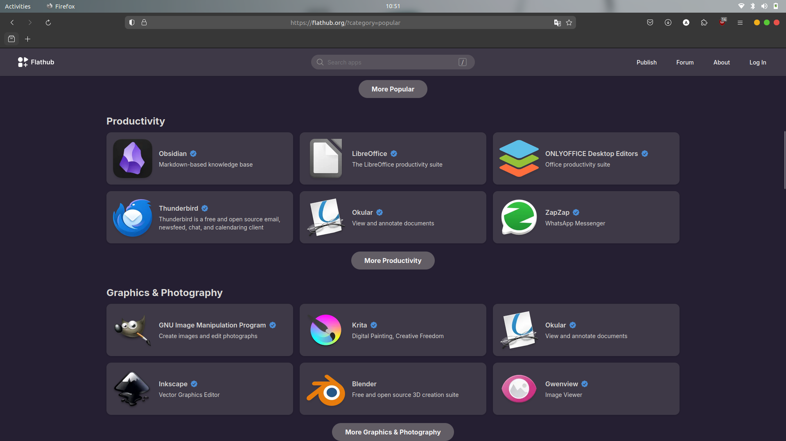
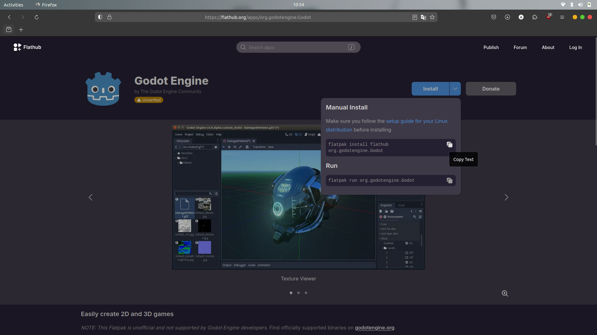

# Instalasi Aplikasi di Ubuntu  Menggunakan CLI dengan FLATPAK
## Tujuan
Setelah menyelesaikan bab ini pembaca diharapkan dapat:
- Menginstal perangkat lunak menggunakan CLI pada Ubuntu dengan FLATPAK.

## Langkah-Langkah Instalasi Melalui CLI dengan FLATPAK
1. **Memastikan Flatpak Terinstal** 
   Sebelum menggunakan Flatpak, pastikan paket Flatpak telah terinstal di sistem. Anda bisa menginstalnya dengan perintah `sudo apt install flatpak`. Agar dapat mengunduh aplikasi, tambahkan Flathub ke sistem Anda dengan perintah `flatpak remote-add --if-not-exists flathub https://flathub.org/repo/flathub.flatpakrepo`

2. **Mencari Aplikasi di Flathub** 
   Untuk mencari aplikasi yang diinginkan, buka situs [Flathub](http://flathub.org) di browser Anda. Di sana anda dapat menjelajahi aplikasi yang tersedia, membaca deskripsi, dan mengonfirmasi ID aplikasi untuk instalasi.

   
 

   

   

3. **Menginstall Aplikasi dengan Flatpak** 
   Setelah menemukan aplikasi di Flathub, catat ID aplikasi yang ditampilkan, dan gunakan perintah berikut untuk instalasi. Sebagai contoh, untuk menginstal **Godot Engine** ketik `flatpak install flathub org.godotengine.Godot`.

   
 

   

   

   Kemudian flatpak akan mendownload aplikasi beserta dependensinya dan menginstalnya secara otomatis.

   
 

   

   

4. **Konfirmasi Instalasi** 
   Jika ada konfirmasi untuk melanjutkan instalasi, sistem akan menampilkan prompt yang meminta anda mengetik "**y**" (yes) untuk melanjutkan. Tekan y dan ***Enter*** untuk konfirmasi.
5. **Instalasi Selesai** 
   Setelah proses selesai, aplikasi siap digunakan. Aplikasi yang telah diinstal dapat ditemukan di menu Applications, atau bisa langsung dibuka melalui terminal dengan mengetik `flatpak install flathub org.godotengine.Godot`.

 

[Sebelumnya](./instalasi_cli_apt.md) 

[Selanjutnya](./instalasi_cli_snap.md) 

