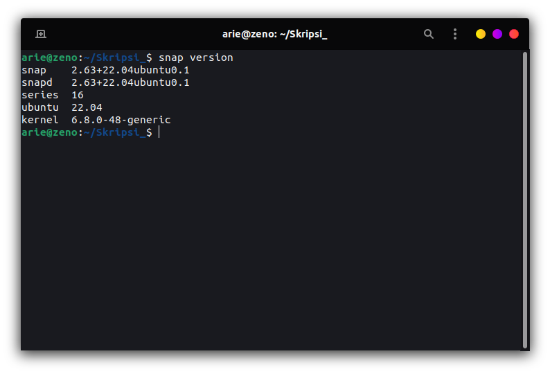
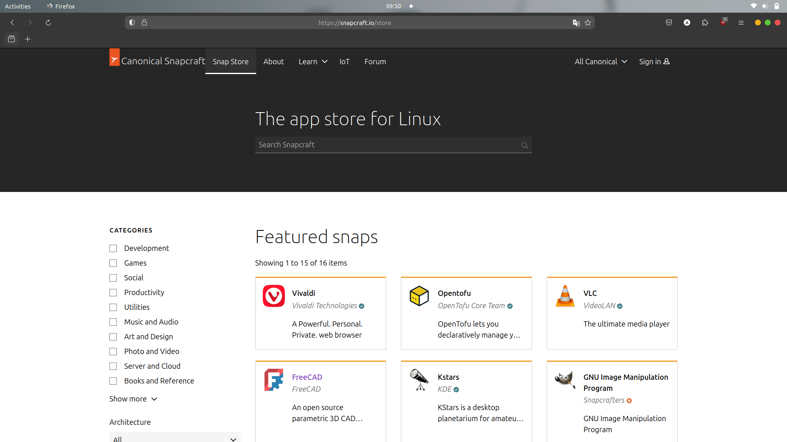
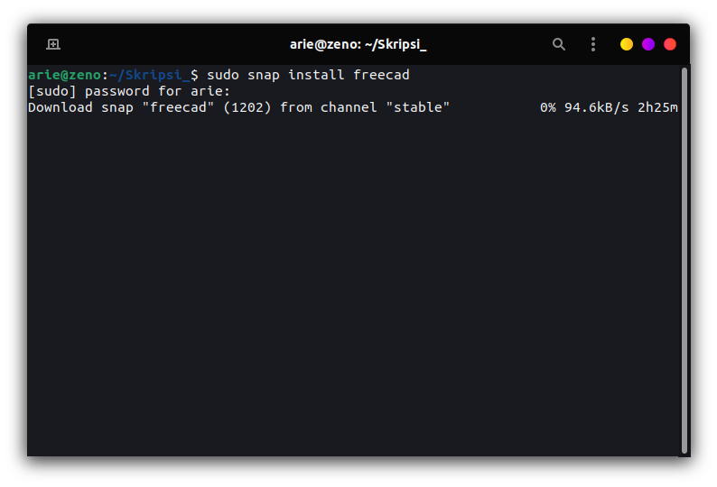

# Instalasi Aplikasi di Ubuntu  Menggunakan CLI dengan SNAP
## Tujuan
Setelah menyelesaikan bab ini pembaca diharapkan dapat:
- Menginstal perangkat lunak menggunakan CLI pada Ubuntu dengan SNAP.

## Langkah-Langkah Instalasi Melalui CLI dengan FLATPAK
1. **Memastikan Flatpak Terinstal** 
   Pada ubuntu 22.04 LTS secara bawaan sudah terinstall snap, untuk memastikan dapat menggunakan perintah `snap version` pada terminal.
   
 

   

   

2. **Mencari Aplikasi di Snapcraft** 
   Untuk mencari aplikasi yang diinginkan, buka situs [Snapcraft](https://snapcraft.io/store) di browser, disana anda dapat menjelajahi aplikasi yang tersedia.

   
 

   

   

3. **Menginstall Aplikasi dengan Snap** 
   Setelah menemukan aplikasi di Snapcraft, salin script instalasi yang ditampilkan, dan gunakan perintah tersebut untuk instalasi. Sebagai contoh, untuk menginstal **freeCAD** menggunakan `sudo snap install freecad`.

   
 

   

   

   Kemudian snap akan mendownload aplikasi beserta dependensinya dan menginstalnya secara otomatis.

   
 

   

   

4. **Instalasi Selesai** 
   Setelah proses selesai, aplikasi siap digunakan. Aplikasi yang telah diinstal dapat ditemukan di menu Applications, atau bisa langsung dibuka melalui terminal dengan mengetik nama aplikasi.

[Sebelumnya](./instalasi_cli_flatpak.md) 

[Selanjutnya](./instalasi_deb_gui_ubuntu_software.md) 

