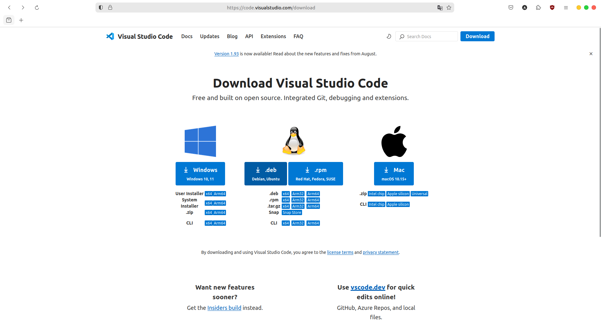
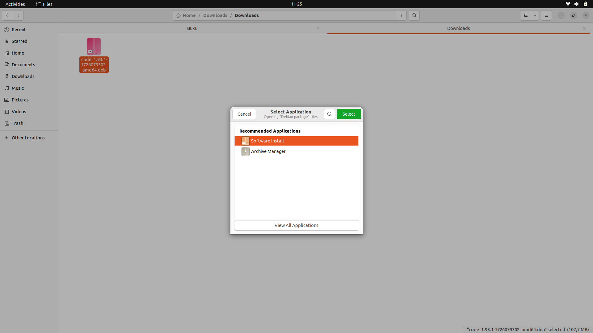
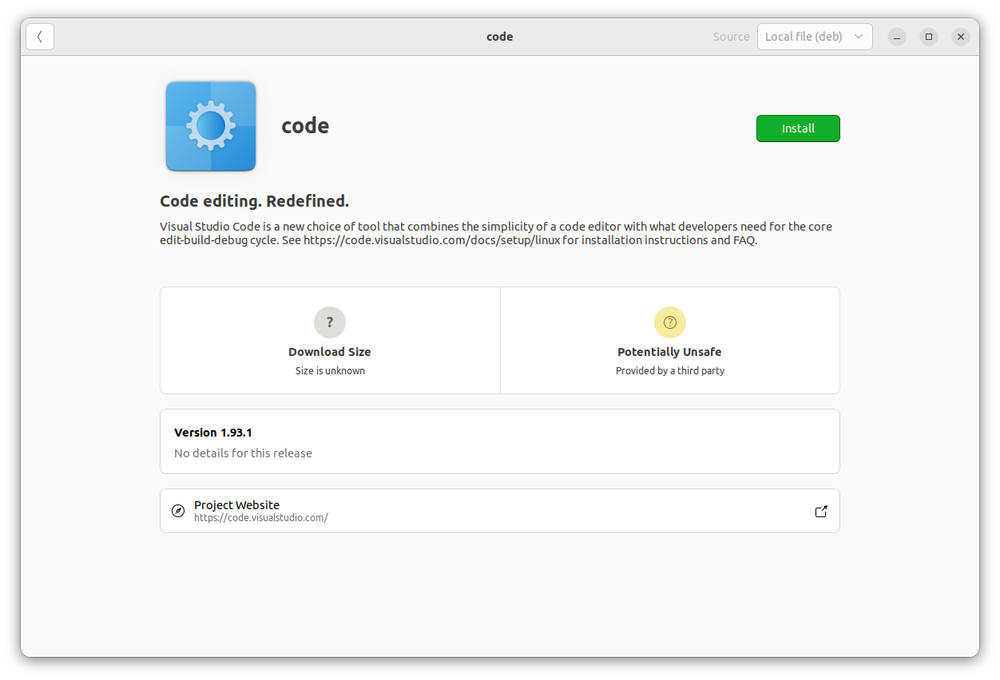
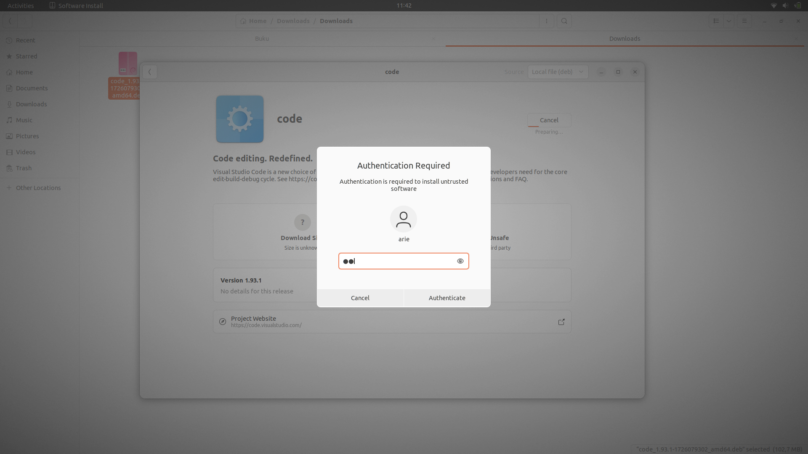
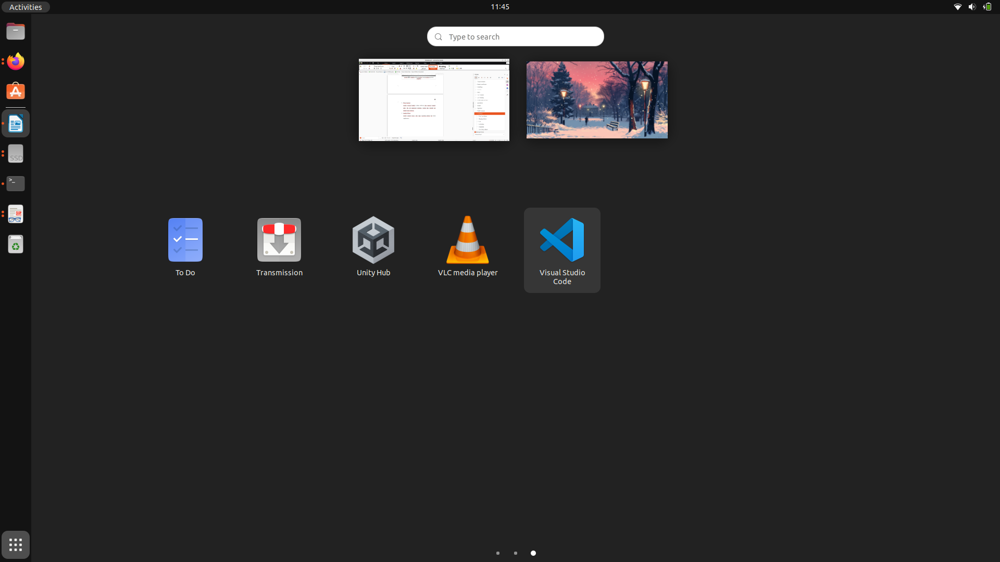

# Instalasi Paket .deb di Ubuntu  Menggunakan GUI dengan GDebi Package Installer
## Tujuan
Setelah menyelesaikan bab ini pembaca diharapkan dapat:
- Menginstal paket .deb menggunakan GDebi Package Installer.

## Langkah-Langkah Instalasi Paket .deb dengan Ubuntu Software
1. **Menginstal GDebi Package Installer** 
   Jika aplikasi GDebi belum terinstal pada sistem, pengguna dapat menginstalnya terlebih dahulu. Hal ini dapat dilakukan melalui terminal dengan perintah **sudo apt install gdebi**.

   
 

   

   

2. **Buka File.deb** 
   Setelah pengunduhan selesai, temukan file yang telah diunduh pada direktori penyimpanan. Klik kanan pada file .deb pilih **Open With Other Application** kemudian pilih **GDebi Package Installer**, File akan terbuka di antarmuka GDebi.

   
 

   

   

3. **Memulai Instalasi** 
   Pada jendela GDebi, klik tombol Install Package untuk memulai proses instalasi. GDebi akan secara otomatis memeriksa dan menginstal dependensi yang diperlukan. 
   
   
 

   

   

   Jika diminta, masukkan kata sandi administrator untuk mengonfirmasi tindakan. Proses instalasi akan berjalan secara otomatis.

   
 

   

   

4. **Memverifikasi Instalasi** 
   Setelah instalasi selesai, aplikasi akan tersedia di menu utama sistem operasi atau dapat membuka aplikasi dari menu **Applications**.

   
 

   

   

  <a href="./proses_instalasi_aplikasi.md">Sebelumnya</a>
  <a href="./instalasi_gui_synaptic.md">Selanjutnya</a>

