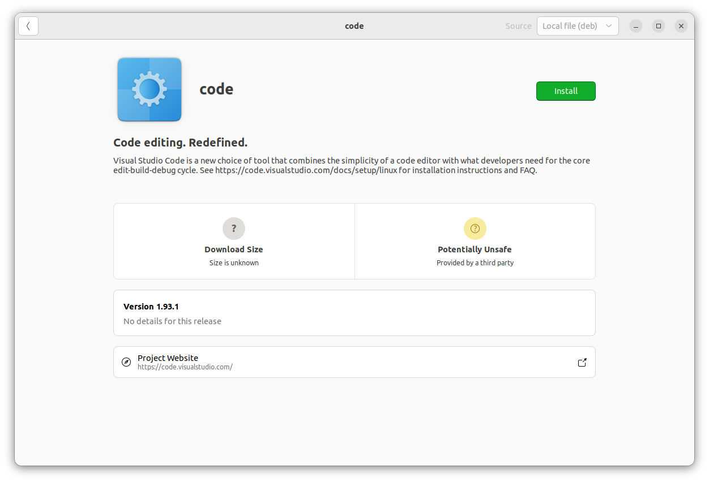

# Instalasi Paket .deb di Ubuntu  Menggunakan GUI dengan Ubuntu Software
## Tujuan
Setelah menyelesaikan bab ini pembaca diharapkan dapat:
- Menginstal paket .deb menggunakan Ubuntu Software.

## Langkah-Langkah Instalasi Paket .deb dengan Ubuntu Software
1. **Mengunduh File.deb** 
   Langkah pertama adalah mengunduh file .deb dari sumber terpercaya. Sebagai contoh, unduh aplikasi **Visual Studi Code** dari situs resminya, yaitu [code.visualstudio.com/download](https://code.visualstudio.com/download). Pastikan file tersimpan pada direktori yang mudah diakses, seperti **Downloads**.
   
 

   

   

2. **Buka File.deb** 
   Setelah pengunduhan selesai, temukan file yang telah diunduh pada direktori penyimpanan. Klik kanan pada file .deb pilih **Open With Other Application** kemudian pilih **software install**, maka aplikasi ubuntu software akan terbuka secara otomatis.

   
 

   

   

3. **Memulai Instalasi** 
   Klik tombol Install pada antarmuka Ubuntu Software. 
   
   
 

   

   

   Jika diminta, masukkan kata sandi administrator untuk mengonfirmasi tindakan. Proses instalasi akan berjalan secara otomatis.

   
 

   

   

4. **Memverifikasi Instalasi** 
   Setelah instalasi selesai, aplikasi akan tersedia di menu utama sistem operasi atau dapat membuka aplikasi dari menu **Applications**.

   
 

   

   

  <a href="./proses_instalasi_aplikasi.md">Sebelumnya</a>
  <a href="./instalasi_gui_synaptic.md">Selanjutnya</a>

