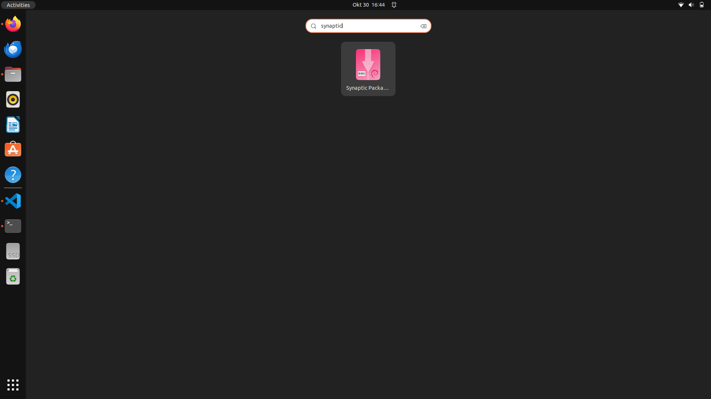
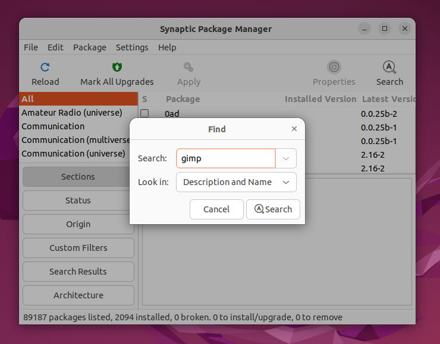
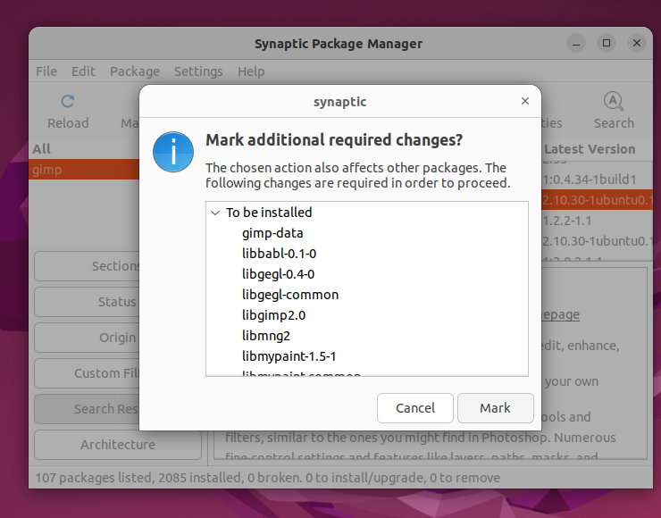
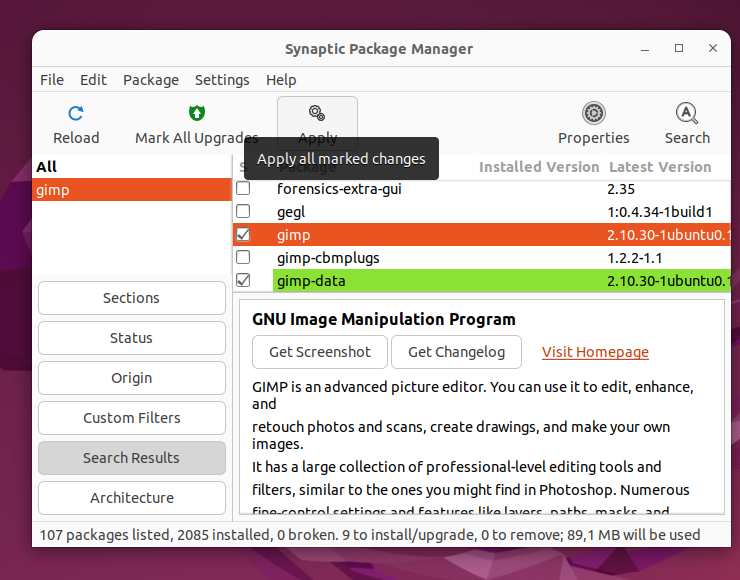
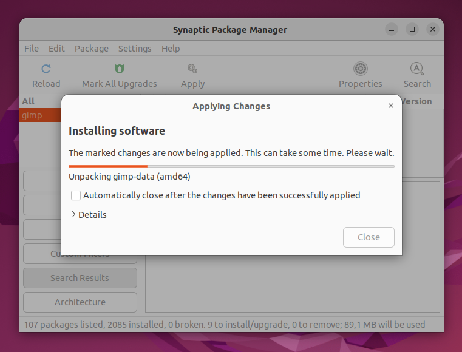
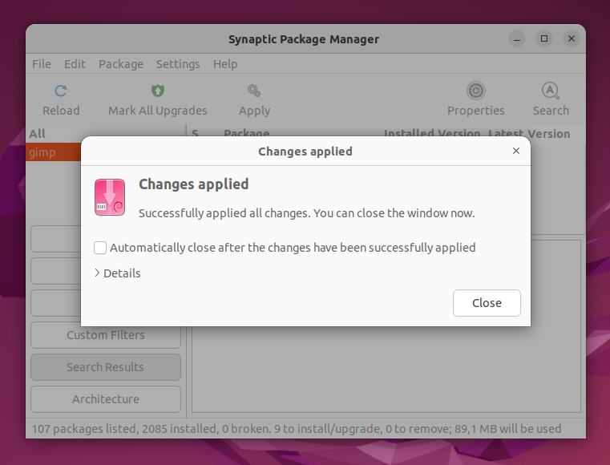

# Instalasi Aplikasi di Ubuntu  Menggunakan GUI dengan Synaptic Package Manager
## Tujuan
Setelah menyelesaikan bab ini pembaca diharapkan dapat:
- Menginstal aplikasi menggunakan GUI pada Ubuntu dengan Synaptic Package Manager.

## Langkah-Langkah Instalasi Melalui GUI dengan Synaptic Package Manager
1. **Buka Synaptic Package Manager** 
   Untuk membuka Synaptic Package Manager dapat ditemukan pada menu applications atau menjalankan perintah `sudo synaptic` pada terminal.

   
 

   

   

2. **Cari Aplikasi yang Diinginkan** 
    Di dalam Synaptic gunakan kotak pencarian di pojok kanan atas untuk mencari aplikasi. Misalnya ketik GIMP untuk mencari aplikasi pengolah gambar.

    
 

   

   

3. **Memilih Paket untuk Instalasi** 
    Setelah menemukan aplikasi yang diinginkan, klik kanan pada nama aplikasi tersebut dan pilih Mark for Installation. Synaptic akan menampilkan daftar paket dan dependensi yang diperlukan untuk aplikasi tersebut, yang juga akan ditandai untuk diinstal. Proses penandaan ini memastikan bahwa semua kebutuhan aplikasi sudah terpenuhi sebelum diinstal.

    
 

   

   

4. **Konfirmasi Instalasi** 
   Setelah aplikasi ditandai, klik tombol *****Apply***** di toolbar bagian atas untuk memulai proses instalasi. 

   
 

   

   

   
   Sebuah jendela konfirmasi akan muncul, menampilkan daftar aplikasi dan dependensi yang akan diinstal. Klik ***Apply*** sekali lagi untuk melanjutkan instalasi. 

   
 

   

   

   Synaptic kemudian akan mengunduh dan menginstal aplikasi serta dependensi yang diperlukan.

   
 

   

   

5. **Menyelesaikan Instalasi**  
    Setelah proses instalasi selesai, anda dapat menemukan aplikasi di menu **Applications**. Dengan Synaptic aplikasi dan semua dependensinya telah diatur dan aplikasi siap digunakan. Jika aplikasi memerlukan pembaruan di masa mendatang, Synaptic akan menampilkannya di daftar pembaruan.

    
 

   

   

  <a href="https://example.com">Sebelumnya</a>
  <a href="https://example.com">Selanjutnya</a>

