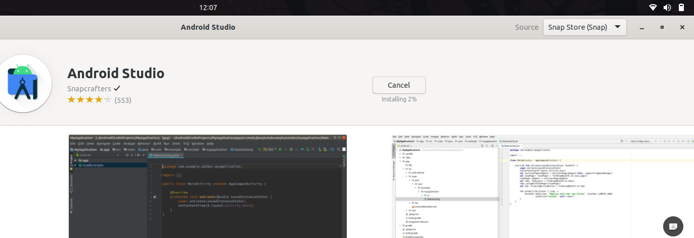

# Instalasi Aplikasi di Ubuntu  Menggunakan GUI dengan Synaptic Package Manager
## Tujuan
Setelah menyelesaikan bab ini pembaca diharapkan dapat:
- Menginstal perangkat lunak menggunakan GUI pada Ubuntu menggunakan Synaptic Package Manager.

## Langkah-Langkah Instalasi Melalui GUI dengan Synaptic Package Manager
1. **Buka Synaptic Package Manager** 
   Untuk membuka Synaptic Package Manager dapat ditemukan pada menu applications atau menjalankan perintah sudo synaptic pada terminal.

   
 

   

   

2. Mencari Paket yang Dibutuhkan
3. Memilih Paket untuk Instalasi
4. Konfirmasi Instalasi
5. Menyelesaikan Instalasi

  <a href="https://example.com">Sebelumnya</a>
  <a href="https://example.com">Selanjutnya</a>

