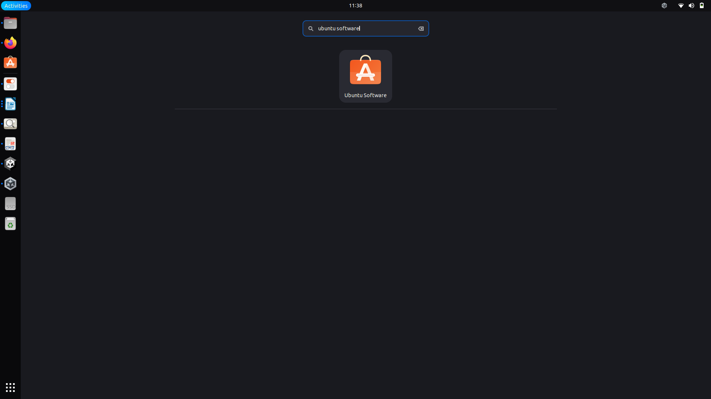
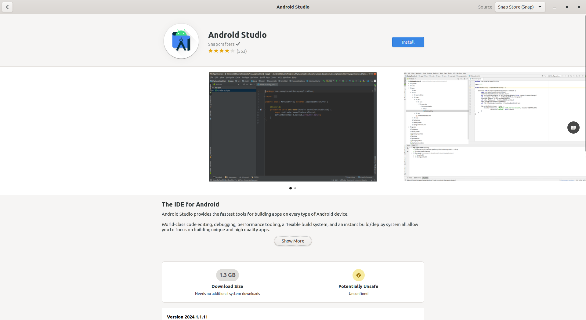
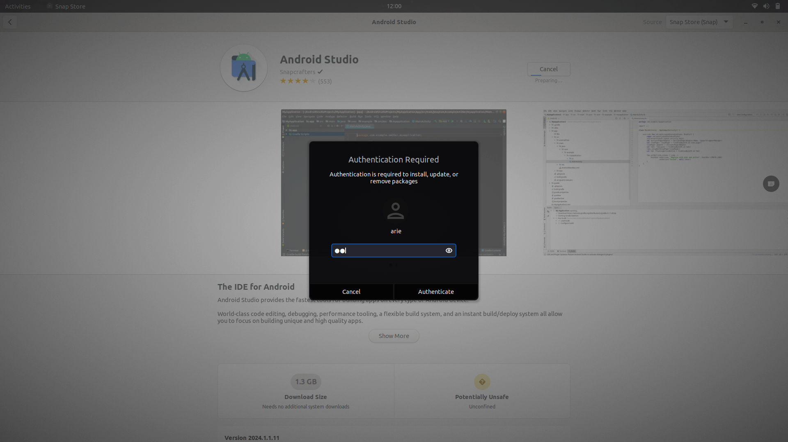
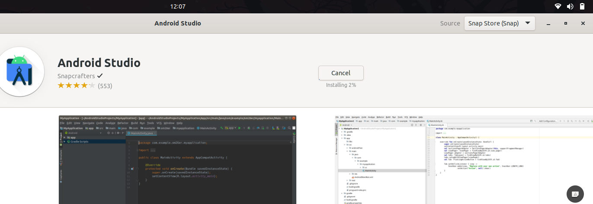

# Instalasi Aplikasi di Ubuntu  Menggunakan GUI dengan Ubuntu Software
## Tujuan
Setelah menyelesaikan bab ini pembaca diharapkan dapat:
- Menginstal perangkat lunak menggunakan GUI pada Ubuntu menggunakan Ubuntu Software.

## Langkah-Langkah Instalasi Melalui GUI dengan Ubuntu Software
1. **Buka Ubuntu Software** 
   Ubuntu Software merupakan tempat untuk mencari dan melakukan instalasi aplikasi yang tersedia secara resmi di repositori Ubuntu. Untuk membukanya, klik ikon Ubuntu Software yang biasanya ada di dock (panel samping kiri) atau cari melalui menu Applications.

   
 

   

   

2. **Cari Aplikasi yang Ingin di Install** 
   Setelah aplikasi terbuka, terdapat kotak pencarian di bagian kiri atas. Gunakan fitur pencarian ini untuk mengetik nama aplikasi yang ingin diinstal, seperti "***Android Studio***". Ubuntu Software akan menampilkan hasil pencarian yang relevan.

3. **Pilih Aplikasi dan Install** 
   Setelah menemukan aplikasi yang diinginkan, klik pada aplikasi tersebut untuk membuka halaman rincian. Di sini anda akan melihat informasi tentang aplikasi, termasuk ukuran, ulasan pengguna, dan pengembangnya. Untuk memulai instalasi tekan tombol ***Install***.
   
 

   

   

4. **Masukkan Password** 
   Karena penginstalan perangkat lunak memerlukan hak akses administrator, anda akan diminta untuk memasukkan password pengguna. Masukkan password akun yang memiliki hak administratif pada sistem, lalu klik ***Authenticate***.

   
 

   

   

5. **Proses Instalasi**  
   Setelah otorisasi berhasil, proses instalasi akan dimulai. anda dapat melihat progress bar yang menunjukkan status instalasi. Jika perangkat lunak yang diinstal memiliki dependensi tambahan, *Ubuntu Software* akan otomatis mengunduh dan melakukan instalasi juga.

   
 

   

   

  <a href="./proses_instalasi_aplikasi.md">Sebelumnya</a>
  <a href="./instalasi_gui_synaptic.md">Selanjutnya</a>

