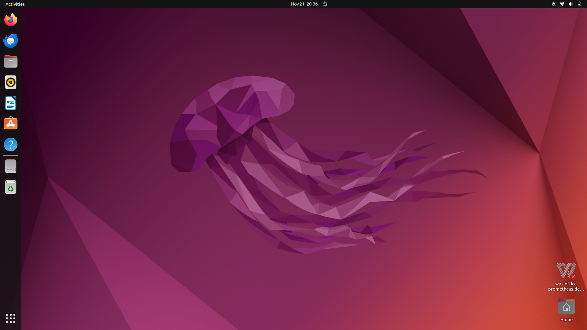
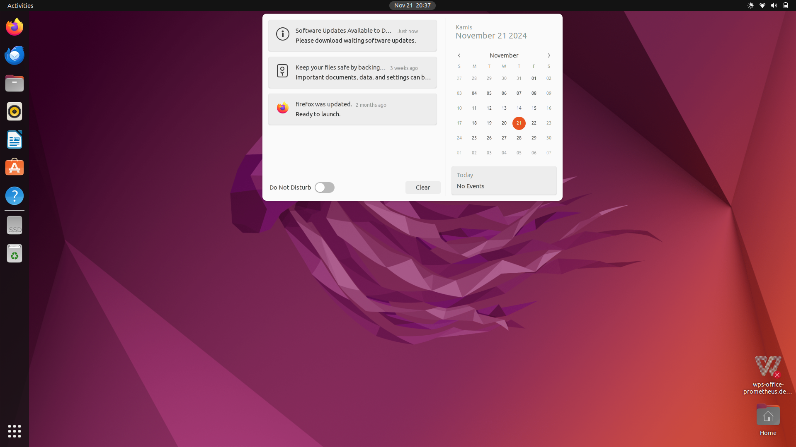
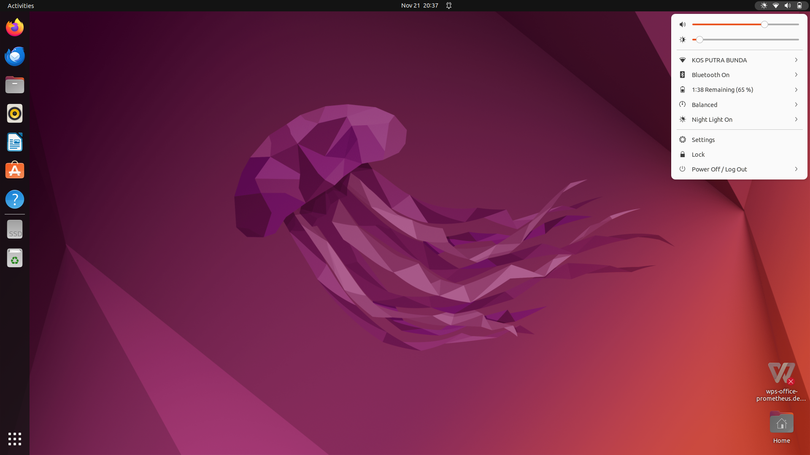
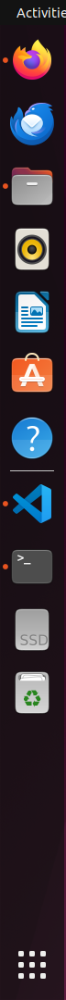
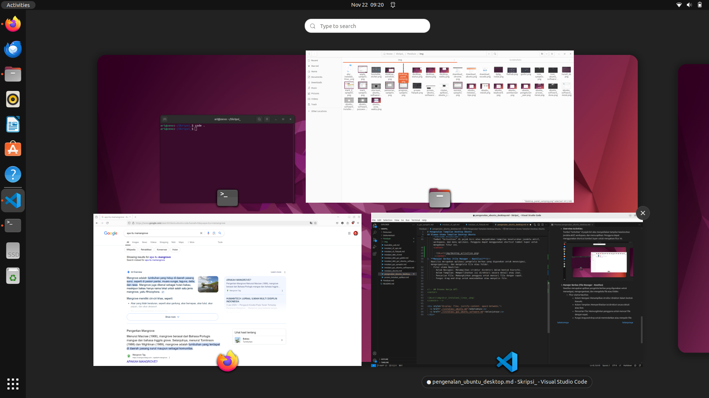

# Pengenalan Tampilan Desktop Ubuntu
## Tujuan
Setelah menyelesaikan bab ini pembaca diharapkan dapat:
- Memahami struktur antarmuka desktop pada sistem operasi Ubuntu.
- Mengetahui fungsi utama dari elemen-elemen yang terdapat pada antarmuka desktop Ubuntu.

Ubuntu menggunakan GNOME Desktop Environment sebagai antarmuka grafis default. GNOME merupakan salah satu lingkungan desktop yang populer di dunia Linux, dikenal karena antarmukanya yang sederhana dan ramah pengguna, serta kaya akan fitur untuk mendukung produktivitas. Pada bagian ini pembaca akan diperkenalkan dengan elemen-elemen utama yang terdapat pada tampilan desktop Ubuntu.

## Elemen Utama Tampilan Desktop Ubuntu
### **Desktop Utama (Main Desktop)** 
   
 

   
   

   Desktop utama merupakan area kerja utama setelah pengguna berhasil masuk. Pada GNOME Desktop Environment, desktop memiliki beberapa elemen kunci:
   - **Panel Atas (Top Bar)**:  
     Panel ini berisi berbagai informasi dan fungsi utama, seperti:
     - Waktu dan Tanggal: Menampilkan waktu sistem dan akses cepat ke kalender.
        
 

       
       

     - Ikon Status Sistem: Menunjukkan status jaringan, daya baterai, dan kontrol suara.
        
 

         
        

        
   - **Dock (Panel Samping)**:  
     Dock berfungsi sebagai tempat pintasan aplikasi (shortcuts) yang sering digunakan serta menampilkan aplikasi yang sedang berjalan.
     - Pintasan bawaan seperti File Manager, Firefox, dan Terminal.
     - Aplikasi dapat ditambahkan ke dock untuk memudahkan akses.
     
 

     
    

  - **Overview Activities**:  
     Tombol “Activities” di pojok kiri atas menyediakan tampilan keseluruhan jendela aktif, workspace, dan menu aplikasi. Pengguna dapat menggunakan shortcut tombol Super untuk mengakses fitur ini.
     
 

       
      

  - **Show Applications**:  
   Tombol "Show Applications" di pojok kiri bawah menyediakan tampilan keseluruhan aplikasi yang sudah terinstall. Pengguna dapat menggunakan shortcut tombol Super 2 kali untuk mengakses fitur ini.
     
 

     
    

  <a href="./instalasi_ubuntu.md">Sebelumnya</a>
  <a href="./instalasi_gui_ubuntu_software.md">Selanjutnya</a>

