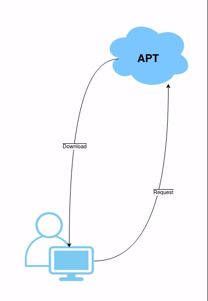

# Pengenalan Tampilan Desktop Ubuntu
## Tujuan
Setelah menyelesaikan bab ini pembaca diharapkan dapat:
- Memahami struktur antarmuka desktop pada sistem operasi Ubuntu.
- Mengetahui fungsi utama dari elemen-elemen yang terdapat pada antarmuka desktop Ubuntu.

Ubuntu menggunakan GNOME Desktop Environment sebagai antarmuka grafis default. GNOME merupakan salah satu lingkungan desktop yang populer di dunia Linux, dikenal karena antarmukanya yang sederhana dan ramah pengguna, serta kaya akan fitur untuk mendukung produktivitas. Pada bagian ini, pembaca akan diperkenalkan dengan elemen-elemen utama yang terdapat pada tampilan desktop Ubuntu, termasuk panel, dock, dan aplikasi bawaan.

## Elemen Utama Tampilan Desktop Ubuntu
1. **Layar Login (Login Screen)** 
   Setelah sistem selesai melakukan proses booting, pengguna akan dihadapkan pada layar login. Layar ini memungkinkan pengguna untuk memilih akun yang akan digunakan, memasukkan kata sandi, dan mengakses sistem.
   - **Elemen utama pada layar login**:
     - Kotak Masuk (Login Field): Kolom untuk memasukkan username dan password.
     - Ikon Pengaturan (Gear Icon): Opsi untuk memilih desktop environment (jika terdapat lebih dari satu DE yang diinstal).
     - Tombol Daya (Power Button): Untuk mematikan, me-restart, atau hibernate sistem.
2. **Desktop Utama (Main Desktop)** 
   Desktop utama merupakan area kerja utama setelah pengguna berhasil masuk. Pada GNOME Desktop Environment, desktop memiliki beberapa elemen kunci:
   - **Panel Atas (Top Bar)**:  
     Panel ini berisi berbagai informasi dan fungsi utama, seperti:
     - Waktu dan Tanggal: Menampilkan waktu sistem dan akses cepat ke kalender.
     - Ikon Status Sistem: Menunjukkan status jaringan, daya baterai, dan kontrol suara.
     - Menu Pengguna: Mengakses pengaturan akun, logout, atau mematikan sistem.
   - **Dock (Panel Samping)**:  
     Dock berfungsi sebagai tempat pintasan aplikasi (shortcuts) yang sering digunakan serta menampilkan aplikasi yang sedang berjalan.
     - Pintasan bawaan seperti File Manager, Firefox, dan Terminal.
     - Aplikasi dapat ditambahkan ke dock untuk memudahkan akses.
  - **Overview Activities**:  
     Tombol “Activities” di pojok kiri atas menyediakan tampilan keseluruhan jendela aktif, workspace, dan menu aplikasi. Pengguna dapat menggunakan shortcut tombol Super untuk mengakses fitur ini.
3. **Manajer Berkas (File Manager - Nautilus)** 
   Nautilus merupakan aplikasi pengelola berkas yang digunakan untuk menavigasi, mengorganisasi, dan mengelola file atau folder.
   - Fitur utama Nautilus:
     - Kolom Navigasi: Menampilkan struktur direktori dalam bentuk hierarki.
     - Kolom Tampilan: Memperlihatkan isi direktori secara detail atau ikon.
     - Pencarian File: Memungkinkan pengguna untuk mencari file dengan cepat.
     - Fungsi drag-and-drop untuk memindahkan atau menyalin file.
  

## Proses Kerja APT:

 

  <a href="./instalasi_ubuntu.md">Sebelumnya</a>
  <a href="./instalasi_gui_ubuntu_software.md">Selanjutnya</a>

