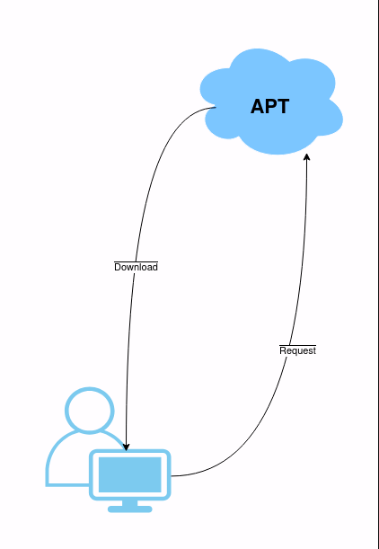

# Proses Instalasi Aplikasi pada Ubuntu
## Tujuan
Setelah menyelesaikan bab ini pembaca diharapkan dapat:
- Memahami proses instalasi aplikasi pada Ubuntu

## Proses Request Paket ke APT
Dalam proses instalasi aplikasi di Ubuntu, baik menggunakan Graphical User Interface (GUI) melalui Ubuntu Software atau Command Line Interface (CLI) melalui terminal, sistem menggunakan APT (Advanced Package Tool) sebagai manajer paket. Saat pengguna meminta instalasi aplikasi, APT akan mengunduh paket aplikasi dari repository yang telah dikonfigurasi di sistem, dan memastikan semua dependensi yang diperlukan juga terpasang.

## Proses Kerja APT:

 

1. Permintaan Client: Ketika pengguna memulai instalasi melalui GUI atau CLI, APT mengirim permintaan ke server repository untuk mendapatkan paket aplikasi.
2. Unduh Paket: APT mengunduh paket dari repository sesuai dengan URL yang terdaftar di sistem. 
3. Instalasi Paket: APT kemudian memasang paket aplikasi di sistem, memastikan bahwa semua dependensi terpasang dengan benar.

  <a href="./instalasi_ubuntu.md">Sebelumnya</a>
  <a href="./instalasi_gui_ubuntu_software.md">Selanjutnya</a>

